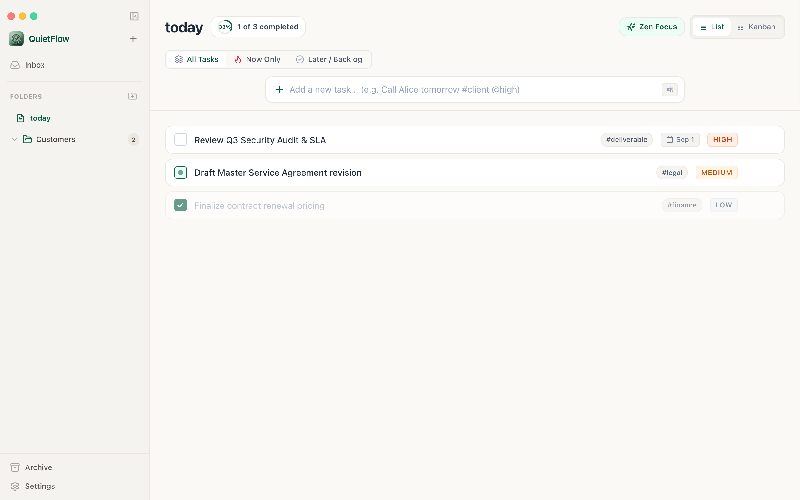
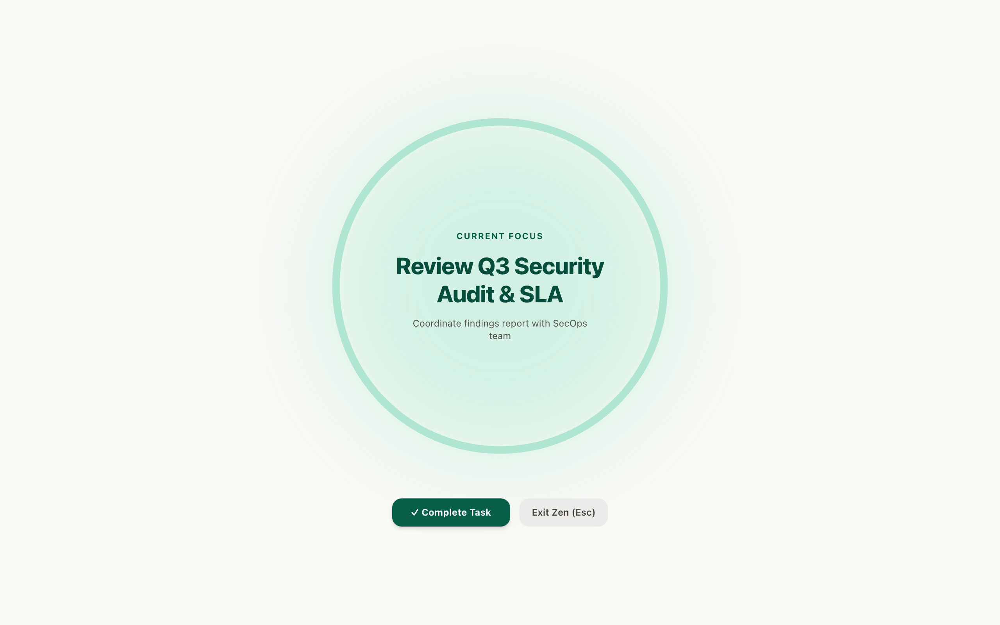
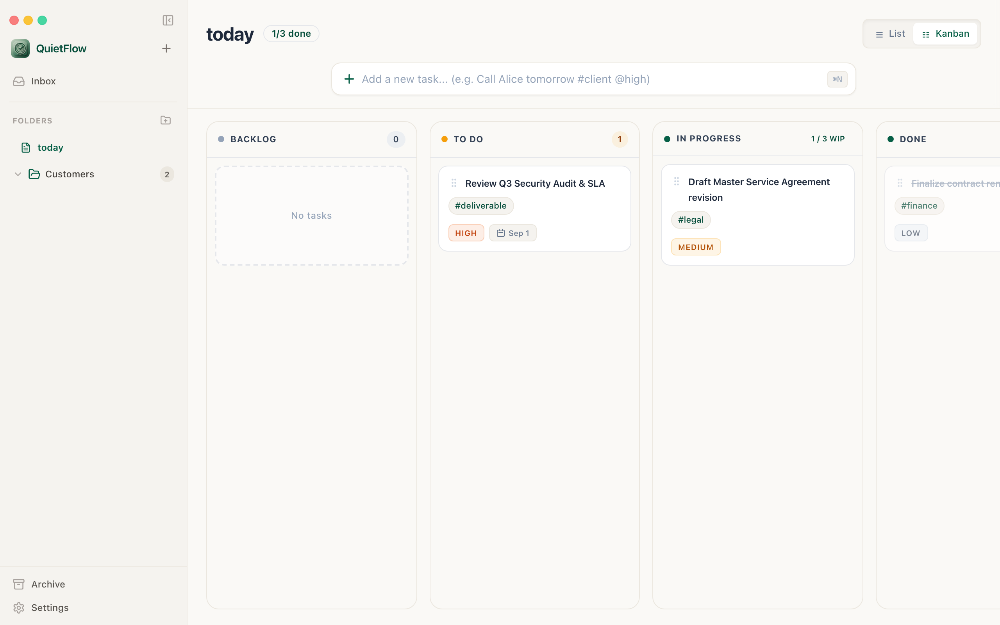
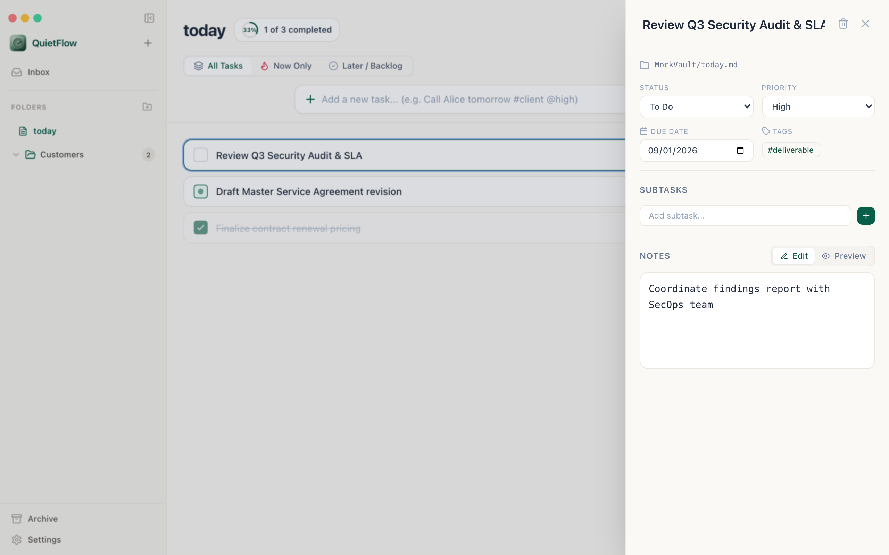
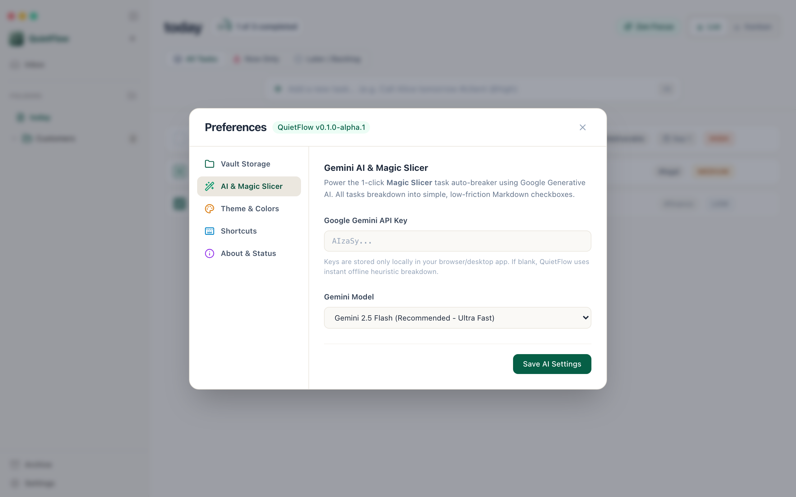

# 🌿 QuietFlow

> A calm, local-first markdown task & notes manager crafted for deep work, speed, and neurodivergent cognitive accessibility.

[](LICENSE)
[]()
[]()

QuietFlow combines the simplicity of plaintext Markdown files with thoughtful ADHD-friendly design patterns: **"One-Thing" Zen Theater**, **Gemini-powered Magic Slicer**, **Breadcrumb Trail cognitive re-entry**, and playful dopamine celebrations.

---

## 📸 Visual Showcase

| **Main Dashboard & Progress Ring** | **"One-Thing" Zen Theater (Soft Aura Time-Sweep)** |
| :---: | :---: |
|  |  |

| **Kanban Board with WIP Limits** | **Slide-Over Markdown Task Notes Drawer** |
| :---: | :---: |
|  |  |

| **Gemini AI & Magic Slicer Settings** |
| :---: |
|  |

---

## 🚀 Getting Started

### Prerequisites
- [Node.js](https://nodejs.org/) (v18+)
- [Rust](https://rustup.rs/) (v1.75+ for native desktop compilation)

### Development Setup
```bash
# 1. Clone the repository
git clone https://github.com/cemendes/QuietFlow.git
cd QuietFlow/"to-do app"

# 2. Install dependencies
npm install

# 3. Start development server (Web mode)
npm run dev

# 4. Start Tauri native desktop app (macOS / Windows / Linux)
npm run tauri dev
```

---

## 🤝 Contributing to QuietFlow

We welcome contributions from designers, developers, neurodivergent accessibility advocates, and productivity enthusiasts!

### Standard Contribution Workflow
1. **Fork the Repository**: Click the **Fork** button at the top right of [`cemendes/QuietFlow`](https://github.com/cemendes/QuietFlow).
2. **Clone your fork**:
   ```bash
   git clone https://github.com/YOUR_USERNAME/QuietFlow.git
   cd QuietFlow/"to-do app"
   ```
3. **Create a Feature Branch**:
   ```bash
   git checkout -b feat/your-awesome-feature
   ```
4. **Make Your Changes & Run Tests**:
   ```bash
   npm test        # Run all 18 Vitest test suites
   npm run build   # Verify TypeScript and Vite production bundle
   ```
5. **Commit and Push**:
   ```bash
   git commit -m "feat: add your feature description"
   git push origin feat/your-awesome-feature
   ```
6. **Open a Pull Request (PR)**:
   Navigate to the [original repository](https://github.com/cemendes/QuietFlow) and click **"New Pull Request"**.

---

## 💡 Ways to Contribute
- 🦄 **New Celebration Animation Themes**: Add kid-friendly, cartoon, or dopamine particle animations in `src/utils/celebrations.ts`.
- 🧠 **Cognitive Accessibility**: Propose UX improvements for executive dysfunction, working memory, and time blindness.
- 🎨 **Themes & Aesthetics**: Add new color palettes adhering to our calm Warm Sand philosophy.
- 🧪 **Tests & Bug Fixes**: Add end-to-end user journey tests or fix cross-platform issues.

---

## 📜 License
QuietFlow is open-source software licensed under the [MIT License](LICENSE).
