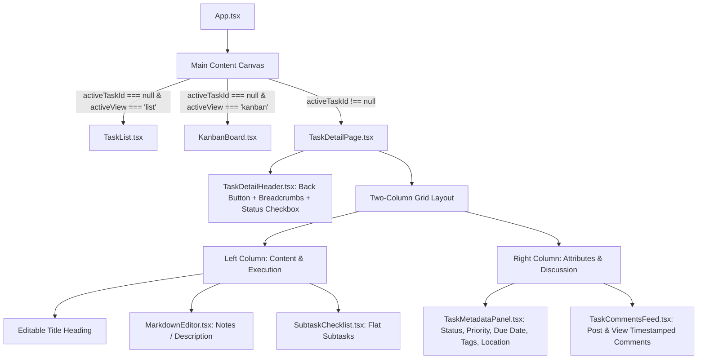

# Design Spec: Full-Page Task Detail & Notes/Comments Redesign

**Date**: 2026-08-29  
**Status**: Ready for Review  
**Project**: QuietFlow Desktop App  
**Target Path**: `docs/superpowers/specs/2026-08-29-task-detail-fullpage-redesign-design.md`

---

## 1. Overview & Objectives

QuietFlow is transitioning its task inspection interface from a narrow slide-out right drawer (`TaskDetailPanel`) to a dedicated **Full-Page Task Detail View** (similar to Linear and Asana). 

### Primary Goals:
1. **Full-Page Immersion**: When a user clicks a task row or Kanban card, the main canvas smoothly navigates from List/Kanban view to the dedicated full-page Task Detail View, offering ample whitespace, high focus, and zero visual clutter.
2. **Two-Column Asana/Linear Layout**:
   - **Left Column (Primary Content)**: Large editable task title, rich Markdown Notes/Description editor, and a flat Subtasks checklist.
   - **Right Column (Metadata & Activity)**: Status, Priority, Due Date, Project/Folder location pill, Tags, and a timestamped Activity/Comments feed.
3. **Local Markdown Comments & Activity Stream**: Activity items and user comments are persisted directly in the Markdown task block using an indented format (e.g. `  - Comment (YYYY-MM-DD HH:mm): <text>`), maintaining 100% local plain-text portability.
4. **Seamless Navigation & Breadcrumbs**: A top navigation bar with a clear "← Back to List / Kanban" button, breadcrumb hierarchy (`[Project] / [Note] / [Task Title]`), and keyboard navigation (`Escape` to return).

---

## 2. Architecture & Component Hierarchy



### Component Breakdown:

1. **`TaskDetailPage.tsx`** (New/Refactored):
   - Replaces the slide-out drawer rendering in `App.tsx`.
   - Takes up the full main canvas (`flex-1 h-full overflow-y-auto bg-sand-50/50`).
   - Handles auto-saving title, description/notes, subtasks, metadata, and comments to the vault store.

2. **`TaskDetailHeader.tsx`**:
   - Back button with icon (`←`) and label (`Back to List` or `Back to Kanban`).
   - Breadcrumb trail: `[Folder Name] / [Note Date/Title]`.
   - Quick action bar: Status checkbox, Mark as Done, Delete Task, Copy Task Link/Title.

3. **`TaskNotesSection.tsx` / `MarkdownEditor.tsx`**:
   - Distraction-free Markdown editor with WYSIWYG or live preview toggle.
   - Clean placeholder ("Add a description, meeting notes, or links...").

4. **`SubtaskChecklist.tsx`**:
   - Flat subtask checklist with completion progress bar (`X of Y completed`).
   - Quick inline text input with Enter-to-add.
   - Per decision: Subtasks remain flat (title + checkbox + delete only).

5. **`TaskMetadataPanel.tsx`**:
   - Compact vertical sidebar widgets for:
     - **Status**: Custom dropdown/picker (Backlog, To Do, In Progress, Done).
     - **Priority**: Terracotta badge picker (None, Low, Medium, High).
     - **Due Date**: Native date picker with quick shortcuts (Today, Tomorrow, Next Week).
     - **Tags**: Interactive pill list with quick add `#tag`.
     - **Location / Origin**: Clickable badge displaying source file (`CCO/2026-08-28.md` or `Inbox.md`).

6. **`TaskCommentsFeed.tsx`**:
   - Chronological stream of comments and timestamped task activity (creation, status changes).
   - "Leave a comment..." input box with `Cmd+Enter` to submit.
   - Formats user comments with ISO timestamp and author badge.

---

## 3. Data Model & Markdown Serialization

### Extended `TaskItem` Interface:

```typescript
export interface TaskComment {
  id: string;
  author?: string; // defaults to 'You' or user profile
  timestamp: string; // ISO string e.g. '2026-08-29T07:30:00.000Z'
  content: string;
}

export interface TaskItem {
  id: string;
  title: string;
  status: TaskStatus;
  priority?: TaskPriority;
  dueDate?: string;
  completedDate?: string;
  tags: string[];
  notes?: string;
  subtasks?: SubtaskItem[];
  comments?: TaskComment[];
  rawLine?: string;
  lineIndex?: number;
  filePath?: string;
}
```

### Markdown Plain-Text Format:

All data is serialized cleanly into local markdown without proprietary wrappers:

```markdown
- [ ] Implement AI Model Training pipeline @high @due(2026-08-30) #infra
  - Notes: Detailed execution plan for training dataset preparation.
    Review CUDA memory requirements before provisioning clusters.
  - [x] Provision H100 GPU cluster
  - [ ] Run synthetic benchmark suite
  - Comment (2026-08-29 07:15): Cluster provisioned in us-east-4 with 8x H100.
  - Comment (2026-08-29 07:22): Waiting for dataset sync from S3 bucket.
```

### Parsing Logic:
1. `parseMarkdownDocument`:
   - Indented lines starting with `- Comment (YYYY-MM-DD HH:mm): <text>` or `- comment (<timestamp>): <text>` are parsed into `TaskComment` objects.
   - Multi-line comments indented with 4 spaces are concatenated to the active comment content.
2. `serializeTaskBlock`:
   - Outputs the task line followed by notes, subtasks, and comments in deterministic order.
   - Preserves formatting compatibility with external tools (Obsidian, Logseq, VS Code).

---

## 4. User Interaction & State Transitions

1. **Entering Task Detail View**:
   - Clicking any `TaskRow` in `TaskList` or `KanbanCard` in `KanbanBoard` dispatches `setActiveTaskId(task.id)`.
   - `App.tsx` evaluates `activeTaskId`:
     - When `activeTaskId` is not null: renders `<TaskDetailPage />` across the entire canvas.
     - When `activeTaskId` is null: renders `<TaskList />` or `<KanbanBoard />` based on `activeView`.
2. **Exiting Task Detail View**:
   - Clicking `← Back` button or pressing `Escape` calls `setActiveTaskId(null)`.
   - The user returns immediately to the exact folder, search filter, and list/kanban view state they were previously in.
3. **Real-Time Auto-Save**:
   - Changes to Title, Notes, Subtasks, or Metadata invoke `updateTask(taskId, updates)` which debounces disk writes (atomic file save via Tauri IPC).
   - Comments post immediately upon clicking "Comment" or pressing `Cmd+Enter`.

---

## 5. Testing & Verification Plan

### Automated Tests:
1. **Parser & Serializer Unit Tests (`parser.test.ts`, `serializer.test.ts`)**:
   - Verify parsing task blocks with notes, subtasks, and comments.
   - Verify adding, modifying, and deleting comments without corrupting subtasks or adjacent markdown headings.
2. **Full-Page Task Detail Component Tests (`TaskDetailPage.test.tsx`)**:
   - Verify full-page render with title, notes, subtasks, metadata, and comment feed.
   - Verify `← Back` button and `Escape` key trigger `setActiveTaskId(null)`.
   - Verify adding subtasks and comments updates state and triggers store `updateTask`.
3. **End-to-End Vault Flow Test (`tests/e2e/vault-flow.test.tsx`)**:
   - Verify clicking a task in Kanban or List navigates to full-page detail.
   - Verify updating notes and posting a comment writes valid Markdown to disk.
   - Verify clicking Back returns to Kanban/List with updated status and counts.

---

## 6. Self-Review & Integrity Check

- **Placeholder Scan**: No TBDs, TODOs, or unresolved logic.
- **Consistency**: Data structures match `parser.ts` and `types.ts`; UI matches macOS Warm Sand + Forest Emerald design system.
- **Scope**: Focused strictly on the Task Detail full-page transition, Asana-style 2-column layout, subtasks, and markdown comments feed.
