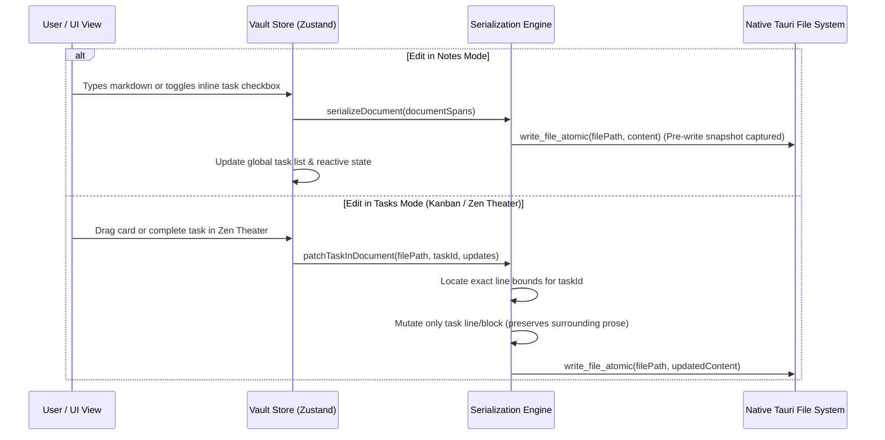

# 🌿 QuietFlow — Hybrid Notes & Tasks Document Engine Design Spec

## 1. Executive Summary & Goals

QuietFlow has operated primarily as an action-oriented task manager (Dashboard, Kanban with WIP limits, "One-Thing" Zen Theater). However, deep work requires unstructured thinking, brainstorming, meeting notes, and research documentation alongside actionable commitments.

This specification introduces a **Hybrid Notes & Tasks Document Engine** that elevates QuietFlow into a full-featured, local-first Markdown knowledge base where **freeform prose and actionable tasks coexist in the exact same file without friction**.

### Core Goals:
1. **Unified Markdown Representation**: Any Markdown document (`.md`) in the vault can hold headers, prose, code blocks, images, math, and interactive task checklists (`- [ ]`).
2. **First-Class Notes Mode**: A dedicated, distraction-free Live Preview writing environment with a document outline, word counts, and instant inline task interaction.
3. **Seamless Two-Way Sync**: Actions taken in Task views (e.g. marking a task done in Zen Theater or dragging a card in Kanban) non-destructively patch the exact line in the note on disk, preserving surrounding paragraphs and formatting byte-for-byte.
4. **Local-First & Obsidian Portability**: 100% standard CommonMark/GFM compliance; vault files can be opened and edited in Obsidian, VS Code, or standard text editors.

---

## 2. Information Architecture & Navigation

```text
┌─────────────────────────────────────────────────────────────────────────────┐
│ 🌿 QuietFlow     [ 📋 Tasks (12) | 📝 Notes ]        🔍 Cmd+K   ⚙️ Settings │
├─────────────────┬──────────────────────────────────────────┬────────────────┤
│  Vault Sidebar  │          Main Document Canvas            │   Meta Rail    │
│  (260px)        │          (Max 800px Centered)            │   (220px)      │
├─────────────────┼──────────────────────────────────────────┼────────────────┤
│ 📁 01 Projects  │  # Sprint Planning & Deep Work           │ 📑 Outline     │
│   📄 Sprint.md* │  Created Oct 24 • #engineering #roadmap  │  • Context     │
│ 📁 02 Dailies   │                                          │  • Actions     │
│ 📁 03 Notes     │  We are refactoring the AST engine...    │  • Code        │
│                 │                                          │                │
│                 │  ## Action Items & Deliverables          │ 📊 Progress    │
│                 │  [ ] Refactor Markdown AST parser [high] │ 1 of 3 Done    │
│                 │      [x] Define node interface           │                │
│                 │      [ ] Preserve line offset markers    │ 🔗 Backlinks   │
│                 │  [x] Implement snapshot rate limiter     │                │
│                 │                                          │                │
│                 │  ```typescript                           │                │
│                 │  const snapshotDebounce = 120_000;       │                │
│                 │  ```                                     │                │
│                 │                                          │                │
│                 │  ┌── 💡 Zen Tip ──────────────────────┐  │                │
│                 │  │ Focus on one active task at a time │  │                │
│                 │  └────────────────────────────────────┘  │                │
└─────────────────┴──────────────────────────────────────────┴────────────────┘
```

### 2.1 Mode Navigation
- **Primary Switcher**: Top-level segmented control in the title bar / header:
  - `📋 Tasks` (`Cmd+1`): Displays the task execution views (Main Dashboard, Kanban Board, Zen Theater, Matrix).
  - `📝 Notes` (`Cmd+2`): Displays the full-page Document Editor, Vault file hierarchy, and contextual metadata rail.
- **Cross-View Deep Linking**:
  - Task cards in Kanban and Zen Theater display a source note chip (e.g. `📄 Sprint Planning.md`).
  - Clicking the chip or pressing `Cmd+Enter` on a task jumps directly into `Notes Mode`, loading the document and scrolling to the exact task line.

---

## 3. Data Architecture & Markdown AST Engine

### 3.1 Domain Model Extensions (`src/core/markdown/types.ts`)

```typescript
export interface DocumentSpan {
  id: string;
  type: 'heading' | 'prose' | 'code' | 'task' | 'callout' | 'thematic-break';
  rawText: string;
  startLine: number;
  endLine: number;
  taskId?: string; // Links to TaskItem if type === 'task'
}

export interface VaultDocument {
  filePath: string;
  frontmatter: Frontmatter;
  tasks: TaskItem[];
  spans: DocumentSpan[];
  rawContent: string;
  body: string;
  wordCount: number;
  readingTimeMinutes: number;
  lastModified: number;
}
```

### 3.2 Parsing Pipeline (`src/core/markdown/parser.ts`)
1. **Frontmatter Extraction**: Uses existing `gray-matter` with browser polyfill to extract YAML metadata.
2. **Document Span Tokenization**: Iterates through the body line-by-line:
   - Tracks fenced code blocks (` ``` `) to prevent parsing checklist items inside code examples.
   - Detects top-level and indented task blocks (`- [ ]`, `- [x]`, `* [ ]`).
   - Group non-task lines into contiguous `prose`, `heading`, or `callout` spans with line index bounds `[startLine, endLine]`.
3. **Task Entity Generation**: Constructs full `TaskItem` models (with subtasks, priority, tags, comments) and associates each with its `DocumentSpan`.

---

## 4. Two-Way Non-Destructive Synchronization Engine



### 4.1 Invariants & Safety
1. **Byte-for-Byte Preservation**: Paragraphs, LaTeX formulas (`$$`), custom headings, and blank lines outside the target task are strictly untouched.
2. **Pre-Write Snapshot Guard**: Every write continues to pass through QuietFlow's snapshot engine (`.quietflow/snapshots/<file>/<timestamp>.md`), guaranteeing zero data loss.
3. **Cursor Stability**: Inline checkbox toggles in Notes Mode do not trigger full editor unmounts or cursor position resets.

---

## 5. UI Components & Interactions

### 5.1 Editor Canvas (`src/components/notes/DocumentEditor.tsx`)
- Distraction-free writing canvas centered at 800px maximum width.
- Markdown Live Preview with smooth typography (Inter + JetBrains Mono for code).
- Interactive `- [ ]` checkboxes embedded in text:
  - `Click checkbox`: Toggles done state (`[ ]` $\leftrightarrow$ `[x]`).
  - `Hover task`: Reveals quick-priority popup badge (`low`, `medium`, `high`) and due date picker.
- Zen Callout blocks (`> [!NOTE]`, `> [!TIP]`) styled with soft emerald tints.

### 5.2 Vault Explorer Sidebar (`src/components/notes/VaultSidebar.tsx`)
- Tree navigation for folders and notes.
- Right-click context menus: "New Note", "New Folder", "Rename", "Delete", "Version History".
- Filter bar for quick note search by title or `#tag`.

### 5.3 Document Meta Rail (`src/components/notes/DocumentMetaRail.tsx`)
- Live Table of Contents (TOC) with smooth-scrolling header anchors.
- Task completion progress ring (`X of Y tasks completed`).
- Word count, character count, and estimated reading time.

---

## 6. Testing & Autonomous Verification Strategy

1. **AST & Parsing Unit Tests (`tests/unit/hybrid-parser.test.ts`)**:
   - Mixed document parsing with interleaved paragraphs, code blocks, and tasks.
   - Non-destructive task replacement preserving surrounding arbitrary text.
2. **Fuzzing & Garbage Invariant Tests (`tests/unit/hybrid-fuzzer.test.ts`)**:
   - 100-iteration random garbage insertion verifying no corrupted spans or runtime exceptions.
3. **Integration & E2E Autonomous Tests (`tests/e2e/notes-mode.test.tsx`)**:
   - Testing mode switching (`Cmd+1` $\leftrightarrow$ `Cmd+2`).
   - Typing notes, creating inline tasks, checking tasks in Notes Mode, and verifying reflection in Kanban view.
4. **Playwright Autonomous Menu & Crawler Test (`tests/autonomous/notes-crawler.spec.ts`)**:
   - Verifying all sidebar folder actions, note creation, and tab switches without unhandled errors.
