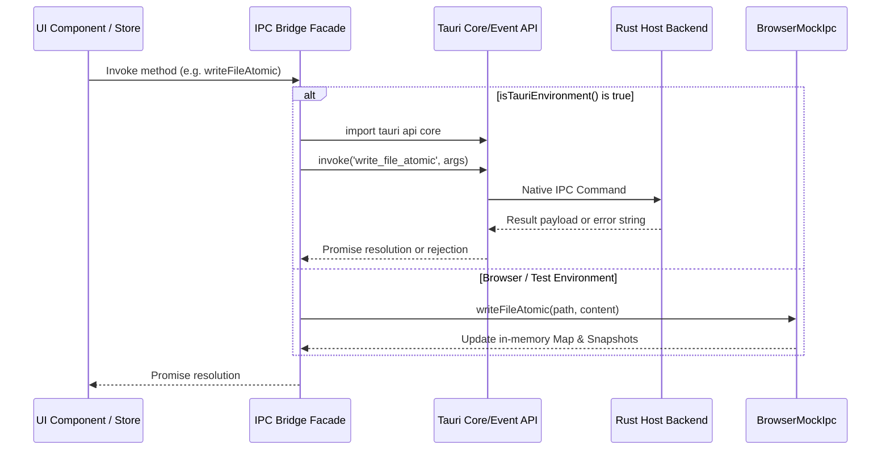
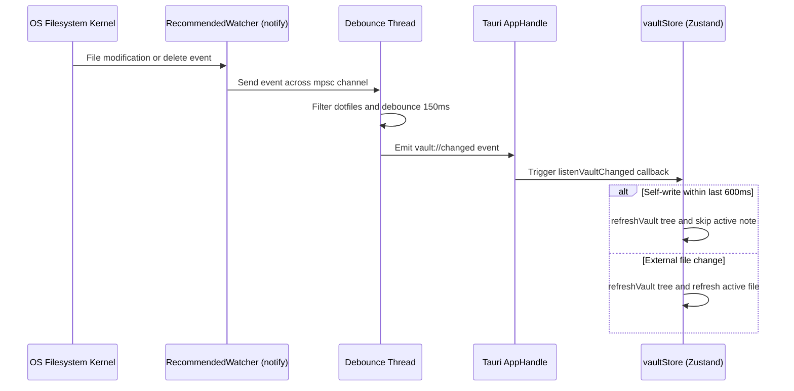

# IPC Bridge & Host Communication

The IPC Bridge forms the execution boundary between QuietFlow's React/Zustand frontend and host environment capabilities. It decouples UI components and state stores from native OS file operations, window controls, and filesystem events. Through a dual-engine architecture, the application seamlessly routes commands to a Tauri v2 Rust backend when running as a native desktop application, or to an in-memory mock engine (`BrowserMockIpc`) when running in standard web browsers or unit test environments.

---

## Architecture & Communication Flow

All interaction with host resources flows through a unified facade exported from `src/store/ipc.ts`. The facade exposes an implementation of the `IpcInterface` contract. When an IPC function is invoked, the bridge checks `isTauriEnvironment()`. If running inside Tauri, it dynamically imports Tauri's IPC core and event modules to issue asynchronous RPC calls to Rust command handlers. Otherwise, it delegates to the fallback engine.


*Figure 1: Dual-engine dispatch routing within the IPC bridge.*

---

## Environment Detection & `IpcInterface` Contract

Environment detection is executed on demand using the `isTauriEnvironment()` function:

```typescript
export function isTauriEnvironment(): boolean {
  return typeof window !== 'undefined' && (!!window.__TAURI_INTERNALS__ || !!window.__TAURI__);
}
```

By leveraging dynamic ES module imports (`import('@tauri-apps/api/core')` and `import('@tauri-apps/api/event')`) inside method calls, the frontend prevents evaluation errors and missing-global exceptions when loaded in standard web browsers.

### `IpcInterface` Definition

The `IpcInterface` contract standardizes 14 operations across filesystem management, app configuration, native event subscriptions, and snapshot versioning:

| Method Signature | Responsibility | Native Tauri Mapping | Browser Mock Fallback |
| :--- | :--- | :--- | :--- |
| `initVault(path)` | Scans directory and returns full `VaultTree` hierarchy | `invoke('init_vault')` | Synthesizes tree from in-memory file map |
| `readFile(path)` | Reads UTF-8 content of a note file | `invoke('read_file')` | Retrieves string from `files` map |
| `writeFileAtomic(path, content)` | Performs crash-safe atomic write to target file | `invoke('write_file_atomic')` | Updates map & creates mock snapshot |
| `createDirectory(path)` | Recursively creates nested directory structure | `invoke('create_directory')` | Adds path to `directories` set |
| `deleteEntry(path)` | Removes file or directory recursively | `invoke('delete_entry')` | Removes from map and set |
| `moveEntry(source, destination)` | Renames or moves file/directory | `invoke('move_entry')` | Re-keys entries in file map / dir set |
| `getDefaultVaultPath()` | Obtains system default vault directory | `invoke('get_default_vault_path')` | Returns `'/MockVault'` |
| `getSavedVaultPath()` | Reads saved vault path from app config | `invoke('get_saved_vault_path')` | Reads `localStorage['quietflow-vault-path']` |
| `setSavedVaultPath(path)` | Saves chosen vault path to app config | `invoke('set_saved_vault_path')` | Writes `localStorage['quietflow-vault-path']` |
| `startWatchingVault(path)` | Spawns OS filesystem watcher for path | `invoke('start_watching_vault')` | No-op |
| `listenVaultChanged(callback)` | Subscribes to backend change notifications | `listen('vault://changed')` | Returns no-op cleanup function |
| `listSnapshots(vaultPath, filePath)` | Retrieves snapshot history metadata for a note | `invoke('list_snapshots_cmd')` | Lists in-memory mock snapshot metadata |
| `restoreSnapshot(vaultPath, filePath, id)` | Overwrites active note with snapshot version | `invoke('restore_snapshot_cmd')` | Restores snapshot content in file map |
| `createManualSnapshot(vaultPath, filePath)` | Bypasses rate-limits to take explicit snapshot | `invoke('create_manual_snapshot_cmd')` | Appends snapshot metadata to mock state |

---

## Native Rust Host Backend

The backend runtime is configured in `src-tauri/src/lib.rs` and implements handler functions across `src-tauri/src/vault/fs.rs`, `src-tauri/src/vault/watcher.rs`, and `src-tauri/src/vault/snapshots.rs`.

### Vault Tree Scanning

`init_vault` triggers `scan_directory_tree`, which recursively inspects the filesystem:

1. **Auto-Initialization**: If the specified directory does not exist, `fs::create_dir_all` creates it alongside a starter `today.md` file.
2. **Dotfile Filtering**: Files and directories starting with `.` (such as `.DS_Store`, `.git`, or `.quietflow`) are skipped.
3. **Sorting**: Directories are sorted first alphabetically, followed by files alphabetically.
4. **Serialization**: Structs map directly to JSON objects consumed by TypeScript:

```rust
#[derive(Debug, Serialize, Deserialize, Clone, PartialEq)]
pub struct VaultNode {
    pub name: String,
    pub path: String,
    #[serde(rename = "isDirectory")]
    pub is_directory: bool,
    pub children: Vec<VaultNode>,
    #[serde(rename = "fileCount")]
    pub file_count: usize,
}
```

### Atomic File Writes & Snapshot Integration

`write_file_atomic` ensures data integrity against power loss or application crashes:

1. Ensures parent directory existence (`fs::create_dir_all`).
2. Triggers `create_pre_write_snapshot_if_needed`, which generates a time-stamped backup in `.quietflow/snapshots/<sanitized_path>/` if the file exists, is non-empty, and has not been snapshotted in the last 120 seconds.
3. Writes new content to a temporary file named `.{filename}.{uuid}.tmp` in the same directory.
4. Calls `file.sync_all()` to flush dirty buffers to physical storage media.
5. Performs an atomic replace using `fs::rename(&temp_path, &target_path)`.

---

## Live Filesystem Event Watching (`vault://changed`)

QuietFlow keeps the user interface in sync with external filesystem modifications (e.g., changes made in external text editors or sync tools) using a native watcher pipeline.


*Figure 2: Event monitoring, debouncing, and store update flow.*

### Watcher Lifecycle & Threading

1. **State Ownership**: Tauri manages thread-safe watcher state via `SafeVaultWatcher` (`Arc<Mutex<VaultWatcherState>>`), registered during builder setup in `src-tauri/src/lib.rs`.
2. **OS Monitoring**: `start_vault_watcher` instantiates a `notify::RecommendedWatcher` with `RecursiveMode::Recursive` on the active vault path.
3. **Debouncing & Filtering**: Events are transmitted across a Rust `mpsc` channel to a background thread:
   - Events where all path filenames start with `.` (such as temporary `.tmp` write files or `.quietflow` snapshot updates) are discarded to prevent event loops.
   - Rapid bursts of events are debounced using trailing silence logic (`rx.recv_timeout(Duration::from_millis(150))`).
   - Once changes settle, the thread fires `app.emit("vault://changed", &path_str)`.

### Frontend Echo Suppression

When `vaultStore.ts` receives a `vault://changed` notification, it evaluates `lastSelfWriteTimestamp`. If the event occurs within 600ms of an application-initiated save, `refreshActiveFile()` is bypassed to prevent in-flight cursor jumps or re-renders during active typing.

---

## Browser Mock Fallback Engine (`BrowserMockIpc`)

When running outside Tauri, `BrowserMockIpc` simulates full vault behavior using in-memory state:

- **Seeding**: `seedDefaultMockFiles()` pre-populates default notes (`/MockVault/today.md`, `/MockVault/Customers/Acme Corp.md`, `/MockVault/Customers/Beta Health.md`).
- **Hierarchy Construction**: `initVault()` dynamically constructs `VaultTree` directory and file nodes by parsing path delimiters (`/`).
- **Persistence**: Saved vault paths are stored in browser `localStorage` under the key `'quietflow-vault-path'`.
- **Snapshot Simulation**: Maintains an internal `mockSnapshots` map, computing task counts by regex scanning task markers (`- [ ]`, `- [x]`) and recording mock metadata.

---

## Testing & Verification

The IPC bridge and native command logic are verified across multiple test suites:

- **Rust Unit Tests**: `src-tauri/src/vault/fs_tests.rs` tests atomic write consistency, missing parent creation, cold-start invalid paths, and dotfile ignore rules.
- **Frontend Store Unit Tests**: `src/store/vaultStore.test.ts` mocks `ipc` functions using `vi.mock('./ipc')` to verify state mutations without host dependencies.
- **Integration Scripts**: `scripts/reproduce-tauri-exact-ipc.mjs` verifies IPC invocation behavior directly against target Rust binaries.
