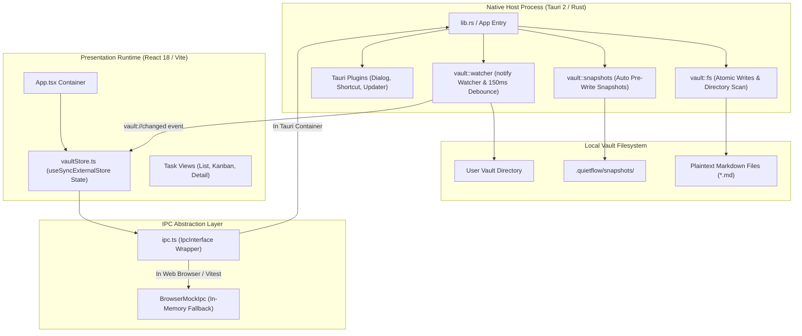
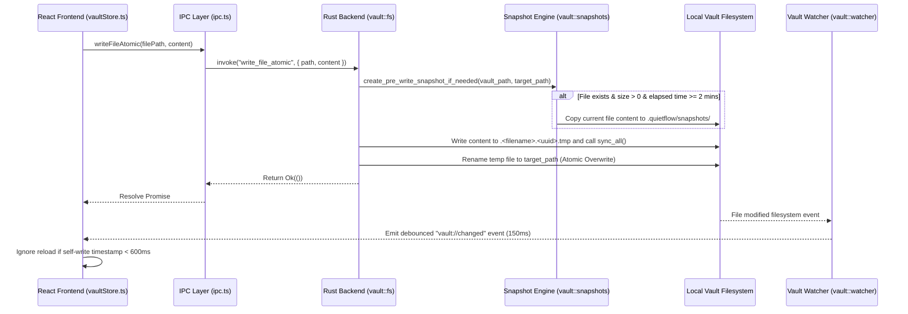

# System Architecture Overview

QuietFlow is a lightweight, local-first desktop to-do and note-taking application designed for calm, distraction-free focus. Its architecture relies on a **dual-layer desktop application model**, combining a native **Tauri 2 Rust host shell** with a reactive **React 18 web presentation runtime**, operating over local **plaintext Markdown storage**.


System architecture of QuietFlow showing the dual-layer Tauri 2 host process, React presentation runtime, IPC bridge, and local vault storage model.

---

## Architectural Philosophy & Core Boundaries

QuietFlow enforces three core design principles across its stack:

1. **Local-First & Plaintext Ownership**: User notes and tasks exist exclusively as standard Markdown files (`.md`) inside a local user directory called the **Vault**. There are no external databases, cloud backend servers, or proprietary binary formats required for core functionality.
2. **Dual-Layer Decoupling**: Native operating system capabilities (filesystem access, file watching, atomic persistence, OS dialogs, system hotkeys) are owned by Rust. UI presentation, markdown rendering, filtering, and view interactions are owned by React.
3. **Resilient Abstraction**: The frontend communicates with the host process via an explicit Inter-Process Communication (IPC) bridge that supports dual execution modes: calling native Tauri APIs in production or switching to an in-memory browser mock during web testing or browser development.

---

## Native Host Process (Tauri 2 & Rust Shell)

The native shell is initialized in `src-tauri/src/lib.rs` using `tauri::Builder` and compiled as `quietflow_lib`. It hosts the webview runtime and manages OS-level integration.

### Responsibilities & Extensions
- **Plugin Integration**: Loads modular Tauri plugins including `tauri-plugin-dialog` (folder selection picker), `tauri-plugin-fs` (low-level file system access), `tauri-plugin-global-shortcut` (system-wide keybindings), `tauri-plugin-updater` (auto-update checks), `tauri-plugin-shell`, and `tauri-plugin-process`.
- **Saved Vault Path Resolution**: Configures and reads the default or user-selected vault path stored in `vault_path.txt` within the application configuration directory (`get_saved_vault_path` and `set_saved_vault_path`).
- **File System Scanning (`vault::fs`)**: Recursively scans user directories (`scan_directory_tree`) to construct nested directory trees (`VaultTree`), while automatically ignoring hidden files and directories (such as `.git` or `.DS_Store`). On cold start or initial directory creation, if `today.md` does not exist, the backend automatically seeds a default `today.md` focus note.

---

## Presentation Runtime (React 18 & Web Environment)

The user interface layer is built with React 18, Vite 5, and Tailwind CSS (`src/App.tsx`). It runs inside the desktop webview or standard web browsers during development.

### Responsibilities
- **Canvas Layout & View Switching**: `App.tsx` manages main application navigation, switching dynamically between `TaskList`, `KanbanBoard`, and `TaskDetailPage`, while hosting modal overlays (`QuickCaptureModal`, `SettingsModal`, `ArchiveModal`) and status banners (`BreadcrumbBanner`, `CorruptionWarningBanner`, `UpdateToast`).
- **State Engine (`vaultStore.ts`)**: Implements an external store pattern via React's `useSyncExternalStore`. It manages global state including current `vaultPath`, `vaultTree`, `activeFile`, parsed `tasks`, `logoConfig`, and snapshot history.
- **In-App Keyboard Shortcuts**: Listens for key combinations (such as `Cmd+N` for Quick Capture and `Cmd+,` for Settings) alongside system-level shortcuts registered via `useGlobalShortcuts`.

---

## Inter-Process Communication (IPC) Abstraction Layer

The frontend interacts with native system features through the `IpcInterface` contract defined in `src/store/ipc.ts`.

```
                    ┌─────────────────────────┐
                    │     Frontend IPC Call   │
                    └────────────┬────────────┘
                                 │
                     isTauriEnvironment()?
                     ┌───────────┴───────────┐
                     │                       │
                  [ Yes ]                 [ No ]
                     │                       │
      ┌──────────────▼──────────────┐  ┌─────▼─────────────────────────┐
      │ @tauri-apps/api/core        │  │ BrowserMockIpc                │
      │ invoke / listen (Tauri IPC) │  │ In-Memory Map Fallback        │
      └──────────────┬──────────────┘  └─────┬─────────────────────────┘
                     │                       │
                     ▼                       ▼
           Native Rust Backend         Browser Runtime / Vitest
```

### Runtime Environment Detection
- **Tauri Mode**: `isTauriEnvironment()` inspects `window.__TAURI_INTERNALS__` or `window.__TAURI__`. When present, IPC calls dynamically import `@tauri-apps/api/core` and invoke native Rust command handlers (`init_vault`, `write_file_atomic`, `read_file`, `start_watching_vault`, etc.).
- **Browser Mock Fallback**: In standard web browsers or headless Vitest suites where Tauri globals are absent, operations route to `BrowserMockIpc`. This class simulates filesystem hierarchy using an in-memory `Map<string, string>`, seeding default mock files for development and testing.

---

## Local-First Storage, Atomic Persistence, & Snapshots

To guarantee zero data loss and prevent file corruption from sudden crashes or power loss, QuietFlow implements atomic file writes, automatic pre-write snapshots, and debounced file watching.


Sequence diagram depicting atomic file persistence, pre-write snapshot creation, file system watching, and state reconciliation flow.

### Atomic Writes (`write_file_atomic`)
When saving note or task changes, `write_file_atomic` in `src-tauri/src/vault/fs.rs`:
1. Ensures parent target directories exist (`create_dir_all`).
2. Triggers the pre-write snapshot check.
3. Writes the new content to a hidden temporary file named `.<filename>.<uuid>.tmp` in the same directory.
4. Executes `file.sync_all()` to flush buffers directly to disk hardware.
5. Performs an atomic `fs::rename` operation overwriting the target file.

### Pre-Write Snapshots (`vault::snapshots`)
Before overwriting an existing file, `create_pre_write_snapshot_if_needed` inspects the file on disk:
- If the file exists and has a byte size greater than 0, it creates a snapshot copy under `.quietflow/snapshots/<sanitized_relative_path>/`.
- **Rate Limiting**: Enforces a 2-minute (`RATE_LIMIT_SECONDS = 120`) minimum interval between automatic snapshots for a given file to prevent disk bloat.
- **Retention Limits**: Keeps a maximum of 20 snapshots per file (`MAX_SNAPSHOTS_PER_FILE = 20`) and cleans up snapshots older than 14 days (`MAX_AGE_DAYS = 14`).
- **Data Recovery**: Allows users to inspect and restore previous snapshots via `list_snapshots_cmd` and `restore_snapshot_cmd`.

### Real-Time File Watching & Event Debouncing (`vault::watcher`)
- **Native Directory Watching**: `start_vault_watcher` utilizes the Rust `notify` crate (`RecommendedWatcher`) to recursively monitor the active vault directory.
- **150ms Trailing Debounce**: Rapid filesystem events are buffered on a background thread until 150 milliseconds of silence pass, filtering out temporary `.tmp` files.
- **Frontend Reconciliation**: Once changes settle, the backend emits `vault://changed` to the frontend via `app.emit`. The React `vaultStore` receives this event, checking `lastSelfWriteTimestamp`. If the write was triggered by the frontend within the last 600ms, external file reloading is skipped to avoid UI flicker while ensuring external edits (e.g. from third-party editors) automatically trigger state synchronization.

---

## Build, Operations & Verification

 quietflow's build system and automated test suite ensure stability across both native Rust and web layers:

| Component | Technology | Configuration / Location |
| :--- | :--- | :--- |
| **Desktop Bundler** | Tauri CLI v2 / Cargo | `src-tauri/Cargo.toml`, `src-tauri/tauri.conf.json` |
| **Web Bundler** | Vite 5 & @vitejs/plugin-react | `vite.config.ts` (port 1420, `@` alias, embedded build metadata) |
| **Frontend Test Suite** | Vitest & JSDOM | `src/store/vaultStore.test.ts` (tests state updates, optimistic task toggling, and IPC mocking) |
| **Backend Test Suite** | Rust `cargo test` | `src-tauri/src/vault/fs_tests.rs` (atomic writes, tree scanning), `snapshots_tests.rs` (corruption recovery) |

### Key Test Coverage
- **Cold Start & Permission Edge Cases**: `test_reproduce_tauri_cold_start_bug` in `fs_tests.rs` verifies error handling when opening restricted paths.
- **Corruption Recovery Verification**: `test_simulate_file_corruption_and_atomic_restore` in `snapshots_tests.rs` simulates sudden zero-byte truncation and verifies 100% data recovery via snapshot restoration.
- **Optimistic UI & Storage Sync**: `vaultStore.test.ts` verifies optimistic task state transitions in React before atomic file IPC execution completes.
