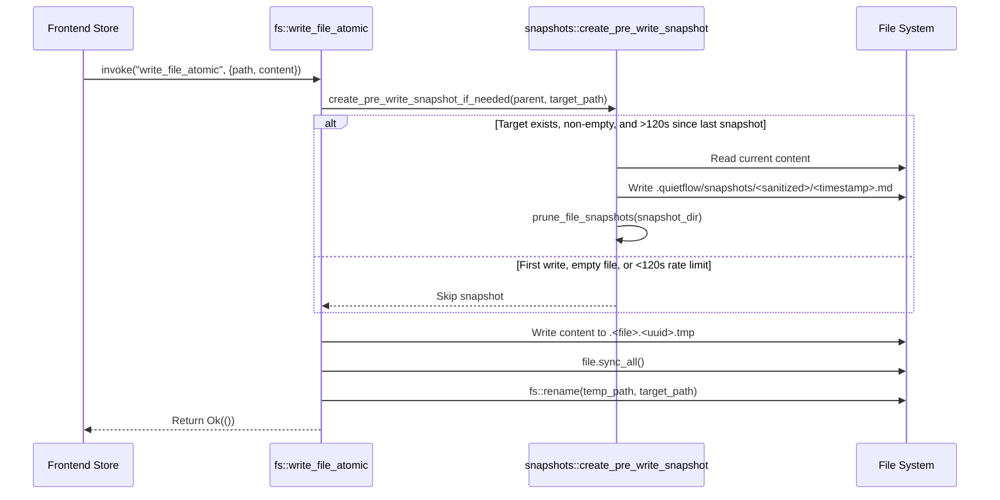

The native Rust backend for QuietFlow is implemented inside the `src-tauri` directory. Built on **Tauri v2**, the Rust layer is responsible for direct filesystem interaction, thread-safe background monitoring, atomic file mutations, local snapshot versioning, and secure application state persistence. By decoupling heavy file I/O operations from the WebKit frontend rendering thread, the Rust backend delivers zero-latency user responsiveness and structural protection against data loss or corruption during file writes.

---

## High-Level Architecture & Lifecycle

The entrypoint for the Rust backend is `/src-tauri/src/main.rs`, which invokes `quietflow_lib::run()` defined in `/src-tauri/src/lib.rs`. The application builder initializes Tauri plugins, registers cross-process state, and binds Rust functions to Tauri's IPC bridge.

```
src-tauri/
├── src/
│   ├── lib.rs              # Application entrypoint, plugin initialization, IPC handler registry
│   ├── main.rs             # Executable binary entrypoint
│   └── vault/              # Vault domain core
│       ├── mod.rs          # Submodule definitions & re-exports
│       ├── fs.rs           # Vault tree recursion, atomic CRUD operations
│       ├── fs_tests.rs     # Integration unit tests for filesystem routines
│       ├── watcher.rs      # Notify file watcher & trailing debounce engine
│       ├── snapshots.rs    # Snapshot creation, listing, atomic restore, pruning
│       └── snapshots_tests.rs # Snapshot & recovery tests
```

### Application Initialization and Managed State

During application startup in `run()`, the Rust backend registers a shared `SafeVaultWatcher` handle managed by Tauri's state system (`tauri::State`).

```rust
pub type SafeVaultWatcher = Arc<Mutex<VaultWatcherState>>;
```

The application builder equips the runtime with shell execution, native dialogs, filesystem plugins, global shortcuts, process management, and auto-updater mechanisms before mounting the IPC command set (`tauri::generate_handler!`).

---

## Vault File Tree Scanning & Hierarchy Construction

The vault structure is represented in memory and serialized across the IPC boundary via `VaultNode` (aliased as `VaultTree`).

```rust
#[derive(Debug, Serialize, Deserialize, Clone, PartialEq)]
pub struct VaultNode {
    pub name: String,
    pub path: String,
    #[serde(rename = "isDirectory")]
    pub is_directory: bool,
    pub children: Vec<VaultNode>,
    #[serde(rename = "fileCount")]
    pub file_count: usize,
}
```

### Recursive Scanning Pipeline (`scan_directory_tree`)

When the frontend invokes `init_vault(path)`, the backend triggers `scan_directory_tree` to recursively inspect the directory hierarchy:

1. **Vault Bootstrapping**: If the target vault path does not exist on disk, `fs::create_dir_all` creates the directory tree. If creation succeeds, an initial `today.md` file is automatically written with standard frontmatter (`title: Today's Focus`) and starter task items.
2. **Permission & Type Validation**: Asserts that the targeted path exists and is a directory. If directory creation fails (e.g. attempting to create system paths like `/Users/QuietFlowVault` without elevated privileges), an error string is propagated back across IPC.
3. **Hidden Entry Exclusion**: Filters out all hidden files and system directories whose name starts with a dot `.` (such as `.git`, `.DS_Store`, `.tmp`, or `.quietflow`).
4. **Hierarchical Traversal**: Subdirectories are recursively scanned via `scan_directory_tree`, accumulating the total `file_count` for child notes.
5. **Deterministic Sorting Invariant**: Children within every directory node are sorted according to a deterministic rule: **directories first alphabetically**, followed by **files alphabetically** (case-insensitive).

---

## Atomic File Persistence & Operations

Direct disk writes risk file corruption if an application crashes or power fails mid-write. To guarantee data integrity, QuietFlow routes all note file modifications through `write_file_atomic`.

### Atomic Write Workflow


*Sequence flow for atomic file writes and automatic pre-write snapshot generation.*

1. **Parent Directory Guarantee**: Ensures the target file's parent directory exists, invoking `fs::create_dir_all` if necessary.
2. **Pre-Write Snapshot Trigger**: Before opening the file for writing, `write_file_atomic` invokes `create_pre_write_snapshot_if_needed`. If the target file already exists and contains content (>0 bytes), an automated snapshot is backed up in `.quietflow/snapshots/` (subject to rate-limiting rules).
3. **Temporary Staging File**: A unique temporary file is created in the *same parent directory* as the target file using the format `.<filename>.<uuid>.tmp`. Creating the temporary file in the same directory guarantees that the file swap occurs within the same filesystem mount and volume, enabling a true atomic rename.
4. **Flush and Hardware Sync**: Content is written to the temporary file, followed by an explicit `file.sync_all()` call to flush memory buffers down to physical media.
5. **Atomic Rename**: `fs::rename` replaces the target note file with the staged temporary file in a single OS filesystem operation. If renaming fails, the temporary file is unlinked automatically.

### Additional CRUD Commands

- `read_file(path)`: Reads note content into memory as UTF-8 via `fs::read_to_string`.
- `create_directory(path)`: Recursively builds subdirectories using `fs::create_dir_all`.
- `delete_entry(path)`: Deletes files using `fs::remove_file` or directories recursively using `fs::remove_dir_all`.
- `move_entry(source_path, destination_path)`: Creates missing destination parent directories if necessary and moves files/folders via `fs::rename`.

---

## Filesystem Notification Engine & Debouncing

QuietFlow maintains real-time synchronization with external file modifications (such as edits made in external text editors or sync tools) using the `notify` cross-platform crate.

<!-- openwiki: mermaid parse failed and this diagram was converted to a text fence so it does not break rendering. Fix the diagram source and restore the mermaid fence. Parser error: Heuristic: an unescaped angle bracket inside a label breaks rendering; rephrase the label. -->
```text
flowchart TD
    A["FileSystem Event (notify)"] --> B{"Is target path hidden file?"}
    B -- "Yes (.DS_Store, .tmp, .quietflow)" --> C["Ignore Event"]
    B -- "No" --> D["Start/Reset 150ms Silence Timer"]
    D --> E{"Subsequent events within 150ms?"}
    E -- "Yes" --> D
    E -- "No (Silence > 150ms)" --> F["Emit vault://changed Event to Tauri Frontend"]
```
*Filtering and trailing debouncing pipeline in the file watcher background thread.*

### Watcher Initialization & State Management (`start_vault_watcher`)

1. **Watcher Instance Lifetime**: `start_vault_watcher` constructs a `notify::RecommendedWatcher` configured for recursive directory watching (`RecursiveMode::Recursive`).
2. **Thread Safety**: The active watcher instance is stored inside the application-wide `SafeVaultWatcher` state (`Arc<Mutex<VaultWatcherState>>`). Holding this reference prevents the underlying operating system file watcher thread from being dropped prematurely.
3. **Cross-Thread Channel**: Raw filesystem events are transmitted through an `std::sync::mpsc::channel()` into a dedicated background worker thread spawned via `std::thread::spawn`.

### Event Debouncing & Suppression Rules

The background watcher worker executes a trailing-edge debouncing algorithm to prevent event storms during rapid text editing or multi-file batch operations:

- **Hidden File Filter**: Inspects event paths; if all affected paths start with a dot `.` (such as temporary write files `.<file>.<uuid>.tmp` or internal snapshot files in `.quietflow`), the event is discarded immediately. This rule prevents self-induced infinite event loops triggered by QuietFlow's own atomic file writes.
- **Trailing Edge Window (150ms)**: Upon receiving an initial unignored filesystem event, the worker thread enters a trailing drain loop using `rx.recv_timeout(Duration::from_millis(150))`. It continuously drains subsequent rapid events until 150 milliseconds of total quiet have elapsed.
- **IPC Event Emission**: Once changes settle, `app.emit("vault://changed", &path_str)` fires a single broadcast payload to update the frontend state.

---

## Local Snapshot Versioning System

QuietFlow incorporates an automatic point-in-time recovery and snapshot engine inside `/src-tauri/src/vault/snapshots.rs`.

### Snapshot Directory Mapping & Sanitization

Snapshots are isolated from normal notes and stored inside a hidden subfolder at the root of the vault:

$$\text{Snapshot Directory} = \text{Vault Root} / \text{.quietflow/snapshots} / \text{Sanitized Relative Path}$$

Relative paths are converted into safe folder names using `sanitize_relative_path`, which strips leading slashes and replaces path separators (`/`, `\`, `:`) with underscores `_`. For instance, a note at `Projects/Work/tasks.md` maps to `.quietflow/snapshots/Projects_Work_tasks.md/`.

Each individual snapshot file is named using the Unix epoch timestamp in seconds: `<unix_epoch_timestamp>.md`.

```rust
#[derive(Debug, Serialize, Deserialize, Clone, PartialEq)]
pub struct SnapshotMetadata {
    pub id: String,
    pub timestamp: String,
    #[serde(rename = "fileName")]
    pub file_name: String,
    #[serde(rename = "relativePath")]
    pub relative_path: String,
    #[serde(rename = "sizeBytes")]
    pub size_bytes: u64,
    #[serde(rename = "snapshotPath")]
    pub snapshot_path: String,
    #[serde(rename = "taskCount")]
    pub task_count: usize,
}
```

### Rate Limiting & Pre-Write Protection

Automated pre-write snapshots (`create_pre_write_snapshot_if_needed`) run automatically before atomic file writes, subject to strict protection rules:

- **Non-Empty File Check**: Files with 0 bytes are skipped.
- **System Isolation**: Writes inside `.quietflow` or paths starting with `.` are ignored.
- **2-Minute Rate Limit (`RATE_LIMIT_SECONDS = 120`)**: Scans the target note's snapshot directory for the newest snapshot modification time. If less than 120 seconds have elapsed since the latest snapshot, creation is bypassed to avoid disk bloat during continuous typing.

### Manual Snapshots & Task Heuristics

Users can trigger manual snapshots at any time via `create_manual_snapshot_cmd(vault_path, file_path)`, which bypasses the 2-minute rate limit.

During snapshot creation, the backend calculates a task count heuristic using `count_tasks_in_content`:

```rust
fn count_tasks_in_content(content: &str) -> usize {
    content
        .lines()
        .filter(|line| {
            let trimmed = line.trim_start();
            trimmed.starts_with("- [ ]")
                || trimmed.starts_with("- [x]")
                || trimmed.starts_with("- [X]")
                || trimmed.starts_with("- [/]")
        })
        .count()
}
```

### Atomic Restoration (`restore_snapshot_cmd`)

When restoring a note to a previous snapshot state:
1. The snapshot file content is loaded from `.quietflow/snapshots/.../<id>.md`.
2. Target directory structure is verified or created.
3. Content is written through a dedicated temporary restore file (`.restoring.<snapshot_id>.<uuid>.tmp`), synced to disk, and renamed atomically over the target note path.

### Snapshot Retention Pruning Policy

Every snapshot creation run finishes by invoking `prune_file_snapshots`, enforcing two key constraints:

| Constraint | Limit | Description |
| :--- | :--- | :--- |
| **Max Retention Age** | `14 days` (`MAX_AGE_DAYS = 14`) | Snapshots with filesystem modification dates older than 14 days are deleted. |
| **Max Snapshot Count** | `20 snapshots` (`MAX_SNAPSHOTS_PER_FILE = 20`) | If remaining snapshots exceed 20 entries, snapshots are sorted by age and the oldest entries are unlinked. |

---

## Vault Path Configuration & OS Integration

QuietFlow manages user vault selection and directory configuration across sessions using system paths and Tauri dialog plugins.

```rust
#[tauri::command]
fn get_saved_vault_path(app: AppHandle) -> String
```

- **Vault Path Persistence**: Stores the active vault path in `vault_path.txt` located inside the operating system's application config directory (`app.path().app_config_dir()`, falling back to `~/Library/Application Support/QuietFlow` on macOS).
- **Default Path Strategy**: `get_default_vault_path()` points to `~/Documents/QuietFlowVault`.
- **Native Folder Selection**: `pick_vault_folder(app)` invokes native OS directory picker dialogs via `tauri_plugin_dialog`.

---

## Verification & Test Suite Coverage

The backend implementation includes focused integration tests under `/src-tauri/src/vault/fs_tests.rs` and `/src-tauri/src/vault/snapshots_tests.rs`.

### Key Verified Behaviors

1. **Cold Start Permission Failure Handling (`test_reproduce_tauri_cold_start_bug`)**: Validates that attempting to initialize an invalid system root path (e.g. `/Users/QuietFlowVault` without standard permissions) returns a descriptive `Err` string rather than crashing the application process.
2. **Atomic Write Roundtrips (`test_atomic_write_and_read`)**: Ensures contents written via `write_file_atomic` match expected content when read back via `read_file`.
3. **Directory Auto-Creation (`test_atomic_write_creates_parent_directory_if_missing`)**: Verifies that atomic writes to deeply nested non-existent subdirectories automatically create all missing intermediate folders.
4. **Hidden File Filter (`test_scan_directory_ignores_hidden_files`)**: Confirms that `.DS_Store` and hidden files are ignored during `init_vault` scans.
5. **Snapshot Recovery & Corruption Resilience (`test_simulate_file_corruption_and_atomic_restore`)**: Simulates complete file corruption (truncating a note to 0 bytes) and verifies that `restore_snapshot` achieves 100% data recovery from saved snapshot backups.
