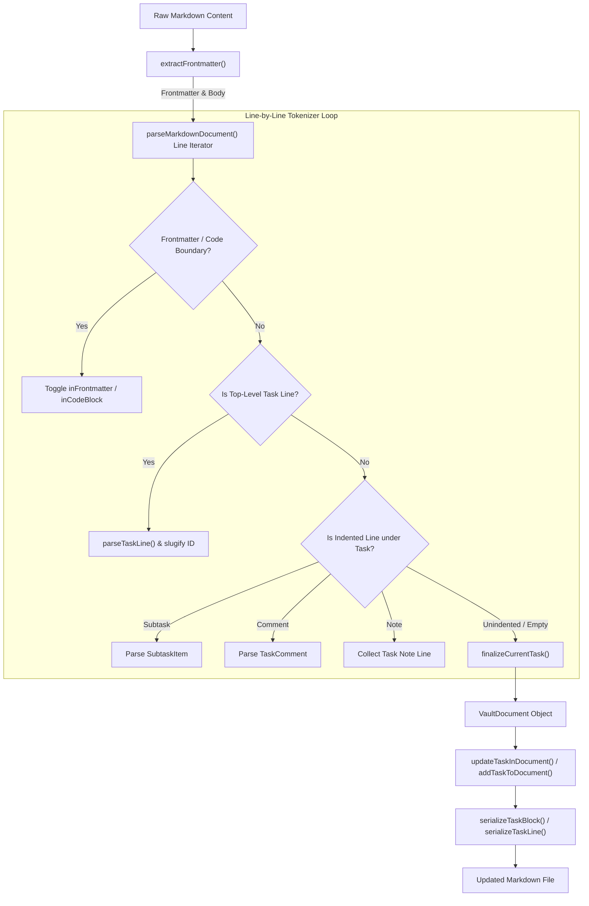
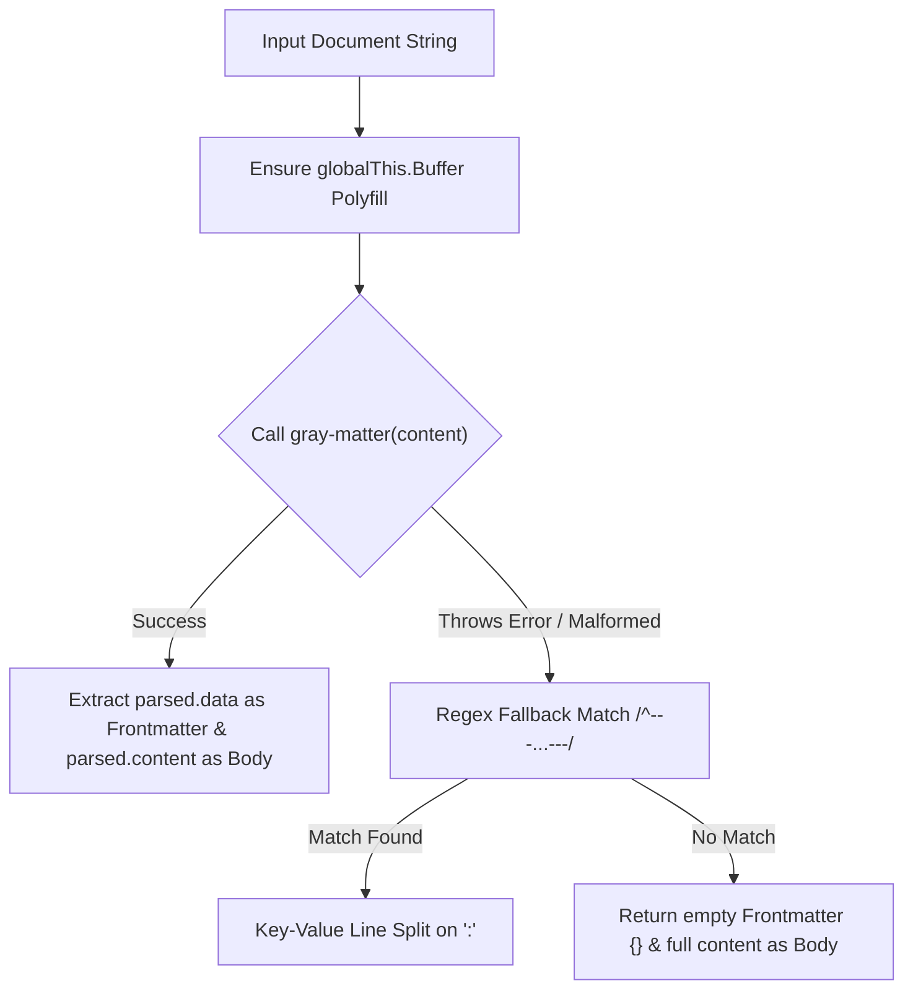

# Markdown Parsing & Serialization Engine

The Markdown Parsing & Serialization Engine located in `src/core/markdown` forms the data translation foundation of OpenWiki. It bridges plain-text Markdown documents stored on disk with structured TypeScript domain entities (`VaultDocument`, `TaskItem`, `SubtaskItem`, `TaskComment`, and `Frontmatter`).

The engine provides non-destructive document manipulation capabilities: it can locate, insert, update, or remove specific task blocks in a file while leaving unrelated headings, frontmatter, free-form prose, and fenced code blocks completely untouched.


*Figure 1: High-level pipeline showing Markdown document parsing, task extraction, structured object creation, and localized serialization.*

---

## Engine Data Architecture

The type definitions in `src/core/markdown/types.ts` govern document structures and task metadata:

| Interface / Type | Purpose | Primary Fields |
| :--- | :--- | :--- |
| `TaskStatus` | Task state enumeration | `'todo' \| 'in-progress' \| 'done' \| 'backlog'` |
| `TaskPriority` | Task priority level | `'low' \| 'medium' \| 'high'` |
| `TaskComment` | Author-attributed discussion comment | `id`, `author`, `timestamp`, `content`, `rawLine` |
| `SubtaskItem` | Nested task item under a parent task | `id`, `title`, `status`, `rawLine`, `lineIndex` |
| `TaskItem` | Top-level task representation | `id`, `title`, `status`, `priority`, `dueDate`, `completedDate`, `tags`, `notes`, `subtasks`, `comments`, `rawLine`, `lineIndex`, `filePath` |
| `Frontmatter` | Key-value page metadata extracted from YAML | `id`, `title`, `category`, `created_at`, `updated_at`, `tags`, `[key: string]: any` |
| `VaultDocument` | Full document domain snapshot | `frontmatter`, `tasks`, `rawContent`, `body` |
| `NewTaskInput` | Input structure for creating tasks | `title`, `status`, `priority`, `dueDate`, `completedDate`, `tags`, `notes`, `subtasks`, `comments` |

---

## Frontmatter Processing & Browser Compatibility

Frontmatter extraction is executed by `extractFrontmatter()` in `src/core/markdown/parser.ts`.


*Figure 2: Fallback strategy during frontmatter extraction ensuring environment and parser fault tolerance.*

### Mechanism and Polyfilling
1. **Node & Renderer Polyfilling**: `gray-matter` depends on Node's `Buffer`. In browser renderer environments, `extractFrontmatter` checks if `globalThis.Buffer` is defined. If undefined, it injects a minimal stub (`isBuffer: () => false`, `from: (str) => str`) to prevent runtime crashes.
2. **Primary Parsing**: Uses `matter(content)` to parse standard YAML blocks surrounded by triple-dash `---` delimiters.
3. **Regex Fallback**: If `gray-matter` throws an exception (such as on unclosed quotes or invalid syntax), the parser falls back to line-by-line regex splitting:
   - Matches frontmatter delimited by `/^---\r?\n([\s\S]*?)\r?\n---\r?\n?([\s\S]*)$/`.
   - Key-value pairs are extracted by splitting on `:` and trimming enclosing quotes.

---

## Markdown Document Parsing

The primary entry point `parseMarkdownDocument(content)` converts a raw Markdown string into a `VaultDocument`.

### Finite State Machine States
During single-pass line iteration, the parser maintains six state trackers:
- `inFrontmatter`: Set to `true` on encountering the first `---` line at index 0, toggled off at the closing `---`.
- `inCodeBlock`: Toggled when encountering lines starting with triple backticks (```). Fenced code blocks suppress task detection so sample checkboxes in code blocks are ignored.
- `currentTask`: Holds the actively constructed `TaskItem`.
- `currentNotes`: Array collecting indented note text.
- `currentSubtasks`: Array of parsed nested `SubtaskItem` instances.
- `currentComments`: Array of parsed `TaskComment` instances.

### Slugification & Stable Task IDs
Task IDs are generated using `slugify(title)` in conjunction with a `slugCounts` Map:
- `slugify`: Converts task titles to lowercase, replaces non-alphanumeric characters with hyphens, trims leading/trailing hyphens, and truncates to 30 characters.
- Base fallback: If the resulting slug is empty, `'item'` is used as the base slug.
- Disambiguation: `slugCounts` counts occurrences of each base slug across the document. The first occurrence gets ID `task-${baseSlug}`, while subsequent duplicate titles receive `task-${baseSlug}-${count}`.
- Stability: Deterministic slug-based IDs ensure that prepending or reordering tasks in a document does not shift or invalidate the IDs of unchanged tasks.

### Line-Level Metadata Extraction
`parseTaskLine()` processes top-level task lines matching `/^-\s*\[([ xX/])\]\s+(.*)$/`:
- **Checkbox Checkmark**:
  - `'x'` or `'X'` maps to status `'done'`.
  - `'/'` maps to status `'in-progress'`.
  - `' '` defaults to status `'todo'`.
- **Inline Annotations**:
  - `@due(YYYY-MM-DD)` or `due:YYYY-MM-DD`: Sets `dueDate`.
  - `@priority(low|medium|high)` or `@high`, `@medium`, `@low`: Sets `priority`.
  - `@status(backlog|todo|in-progress|done)`: Overrides task status. Supports status aliases such as `inprogress` or `completed`.
  - `@completed(YYYY-MM-DD)`: Sets `completedDate`.
  - `#tags`: Extracted via `/(?:^|\s)#([a-zA-Z_][a-zA-Z0-9_-]*)/g`. Requiring tags to begin with a letter or underscore ensures issue identifiers like `#45` in Markdown links or titles are preserved without being mistaken for metadata tags.
- **Title Cleaning**:
<!-- openwiki: broken internal link [...] file "..." does not exist. Fix the href or restore the target, then delete this comment. -->
  All inline annotation tags are stripped from the remainder string to produce a clean `title`. External URLs, Markdown link constructs (e.g., `[PR #45: Fix Navigation Bug](...)`), currency symbols (`$500`), and foreign UTF-8 characters or emojis are preserved.

### Subtasks, Comments, and Notes Hierarchy
When `currentTask` is active, any indented line (starting with 2+ spaces or a tab `^(\s{2,}|\t)`) is parsed into the context of `currentTask`:
1. **Subtasks**: Lines matching `/^(\s{2,}|\t)-\s*\[([ xX/])\]\s+(.*)$/` are appended to `currentSubtasks` with generated IDs (`subtask-${lineIndex}`).
2. **Task Comments**: Lines matching `/^-\s*[Cc]omment\s*\(([^)]+)\):\s*(.*)$/i` are parsed into `currentComments`.
   - If the parenthesis contains comma-separated metadata (e.g., `Eduardo, 2026-08-29 07:15`), author is set to `Eduardo` and timestamp to `2026-08-29 07:15`.
   - If no comma is present (e.g., `2026-08-29 07:25`), author defaults to `'You'`.
3. **Notes**: Any other indented lines are trimmed of `- Notes:` or `- ` prefixes and pushed into `currentNotes`.

When an unindented or empty line is encountered, `finalizeCurrentTask()` consolidates `notes`, `subtasks`, and `comments` into `currentTask` and pushes it into the document task list.

---

## Serialization Engine

The serialization engine in `src/core/markdown/serializer.ts` converts structured task domain models back into Markdown string representations.

### Checkbox Mapping
`getCheckboxForStatus(status)` returns standard Markdown checkbox notation:
- `'done'` $\rightarrow$ `- [x]`
- `'in-progress'` $\rightarrow$ `- [/]`
- `'todo'` or `'backlog'` $\rightarrow$ `- [ ]`

### Task Line Serialization
`serializeTaskLine(task)` constructs the primary line string by appending non-null metadata annotations in strict order:
```text
- [ ] Task Title @status(backlog) @due(2026-09-01) @priority(high) @completed(2026-08-27) #tag1 #tag2
```
1. Checkbox prefix derived from `getCheckboxForStatus(status)`.
2. Title.
3. `@status(backlog)` if status is `'backlog'`.
4. `@due(dueDate)` if `dueDate` is present.
5. `@priority(priority)` if `priority` is set.
6. `@completed(completedDate)` if status is `'done'` and `completedDate` is set.
7. Tags formatted with `#` prefixes joined by spaces.

### Task Block Serialization
`serializeTaskBlock(task)` builds multi-line string arrays for complete task blocks:
- **Main Line**: Formatted via `serializeTaskLine`.
- **Notes Block**: Formatted under 2-space indentation. The first line is prefixed with `  - Notes: `, and subsequent lines are indented with 4 spaces (`    `).
- **Subtask Lines**: Each subtask is formatted with 2 spaces and its status checkbox (`  - [ ] Subtask title`).
- **Comment Lines**: Formatted as `  - Comment (Author, Timestamp): Content`. If the author is `'You'`, the author prefix is omitted (`  - Comment (2026-08-29 07:30): Content`). Continuation lines are indented with 4 spaces.

---

## Non-Destructive Document Mutation API

The parser exports three mutation functions in `src/core/markdown/parser.ts` that update Markdown files in-place without disturbing unrelated content.

### `updateTaskInDocument(content, taskId, updates)`
Modifies an existing task block in a document string:
1. Calls `parseMarkdownDocument(content)` to locate the target `TaskItem` by `taskId` (including fallbacks for legacy line-based ID formats).
2. Determines the exact line boundaries (`startLine` to `endLine`) spanned by the task block by checking indented context lines following `task.lineIndex`.
3. Merges existing properties with `updates`. If the task status changes away from `'done'` and `completedDate` was not explicitly provided in `updates`, `completedDate` is automatically removed.
4. Calls `serializeTaskBlock(mergedTask)` to generate updated lines.
5. Replaces `startLine..endLine` using `lines.splice(...)` and joins lines with `\n`.

### `addTaskToDocument(content, newTask, targetSection?)`
Inserts a new task block into the document string:
1. Serializes `newTask` into line arrays using `serializeTaskBlock`.
2. Scans for a target section heading matching `targetSection` (regex: `/^#+\s*${targetSection}/i`) or falls back to standard section names: `/^#+\s*(Deliverables\s*&\s*Tasks|Tasks|Deliverables|Actions|Action\s*Items)/i`.
3. If a matching section header is found:
   - Finds the section boundary (before the next heading `#+ ` or end of file).
   - Traverses backward past blank trailing lines and splices the new task lines into place.
4. If no matching section header exists:
   - Appends a trailing blank line (if needed) and appends the new task lines at the end of the document.

### `deleteTaskFromDocument(content, taskId)`
Removes a task block from the document string:
1. Locates the target `TaskItem` by `taskId`.
2. Measures `deleteCount` by iterating from `task.lineIndex + 1` until reaching a non-indented line, another task line, or a heading.
3. Splices out `deleteCount` lines starting from `task.lineIndex`.

---

## State Store Integration

The Markdown engine is integrated directly into the application state store in `src/store/vaultStore.ts`:

- **Folder Scanning**: When opening a folder, `vaultStore` collects all `.md` files, calls `parseMarkdownDocument` on each file, attaches `filePath` to every task, and populates `tasks` in global state (`src/store/vaultStore.ts#L224-L237`).
- **File Selection**: Selecting a single file parses its content, creates a `VaultDocument`, attaches `filePath` to task objects, and populates `activeDocument` (`src/store/vaultStore.ts#L256-L267`).
- **Optimistic Task Status & Updates**:
  - `toggleTaskStatus` calls `updateTaskInDocument(content, taskId, { status, completedDate })`.
  - `updateTask` calls `updateTaskInDocument(content, taskId, updates)`.
  - Content changes are persisted through disk writes via `writeVaultFile` and `activeDocument` is updated in memory (`src/store/vaultStore.ts#L428-L441`, `src/store/vaultStore.ts#L471-L479`).
- **Quick Capture Modal**: `QuickCaptureModal.tsx` invokes `addTaskToDocument(content, newTask)` to append newly captured tasks to the active document (`src/components/capture/QuickCaptureModal.tsx#L219`).

---

## Testing & Robustness Guarantees

The markdown engine is covered by comprehensive unit tests (`src/core/markdown/parser.test.ts`) and fuzz testing suites (`src/core/markdown/parser.fuzz.test.ts`):

- **Malformed Frontmatter Fault Tolerance**: `parser.fuzz.test.ts` verifies that unclosed triple dashes, invalid YAML structures, leading whitespace before frontmatter, and unclosed quotes do not cause exceptions.
<!-- openwiki: broken internal link [...] file "..." does not exist. Fix the href or restore the target, then delete this comment. -->
- **URL, Link & Special Character Protection**: Preserves emails (`user.name+tag@example.com`), URLs containing anchors (`https://quietflow.app/docs#getting-started`), Markdown PR references (`[PR #45: ...](...)`), dollar signs (`$500/mo`), and UTF-8 / CJK / emoji characters (`🚀`, `ユーザー登録`, `Проверить`).
- **Deeply Nested Subtasks**: Verified to support deeply nested subtasks (up to 10+ indent levels) without breaking context finalize loops.
- **100-Iteration Fuzzing Suite**: Evaluates parsing, mutation, and addition operations against randomly generated boundary strings containing mixed syntax symbols (`-`, `[ ]`, `[x]`, `[/]`, `@`, `#`, `---`, `<script>`, `{}`).
