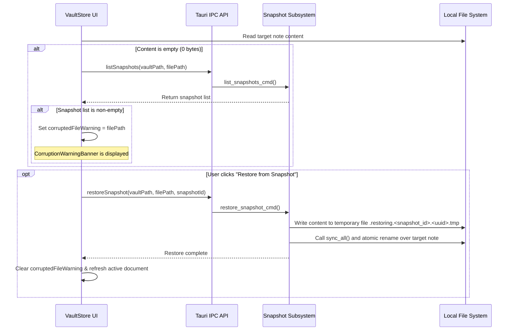

# Snapshot Versioning & Data Recovery

QuietFlow includes a local snapshot versioning and recovery system designed to safeguard user notes against accidental data loss, unexpected app termination, or file corruption. Operating entirely on local disk without cloud dependencies, the system creates pre-write safety backups in the `.quietflow/snapshots` directory before any file modification, enforces rate-limiting and retention limits, automatically flags zero-byte corrupted files, and provides one-click restoration workflows in the user interface.

---

## Architecture & System Responsibilities

The snapshot subsystem spans both the Rust Tauri backend and the React/Zustand frontend:

1. **Pre-Write Interception**: Every file write performed via `write_file_atomic` in Rust speculatively creates a snapshot of the file's current on-disk state prior to replacing its content.
2. **Snapshot Storage & Path Sanitization**: Snapshots are saved in markdown format under `.quietflow/snapshots/<sanitized_relative_path>/<unix_epoch>.md`.
3. **Rate Limiting & Retention**: Automatic snapshots per file are rate-limited to 2-minute windows (`120` seconds). Old snapshots are automatically pruned, keeping at most `20` revisions per file for up to `14` days.
4. **Corruption Detection**: When opening a note, if the current content is empty (`0` bytes) but existing snapshots are found in `.quietflow/snapshots`, the application triggers a file corruption alert state.
5. **Atomic Restoration**: Restoring a snapshot uses atomic file replacement (writing to a temporary file, performing a `sync_all()`, and renaming over the target path) to guarantee data integrity during recovery.

---

## Automatic Pre-Write Snapshot System

### Pre-Write Interception Flow

Before writing new content to an existing file, the atomic file-writing function `write_file_atomic` calls `create_pre_write_snapshot_if_needed`.

<!-- openwiki: mermaid parse failed and this diagram was converted to a text fence so it does not break rendering. Fix the diagram source and restore the mermaid fence. Parser error: Heuristic: an unescaped angle bracket inside a label breaks rendering; rephrase the label. -->
```text
flowchart TD
    A["File Write Request write_file_atomic"] --> B{"Target file exists and size > 0?"}
    B -- No --> C["Proceed to atomic file write"]
    B -- Yes --> D{"Is relative path inside .quietflow or hidden?"}
    D -- Yes --> C
    D -- No --> E["Get file snapshot directory"]
    E --> F{"Newest snapshot modified < 120s ago?"}
    F -- Yes --> C
    F -- No --> G["Read current content & count tasks"]
    G --> H["Write snapshot to .quietflow/snapshots/<sanitized_path>/<unix_epoch>.md"]
    H --> I["Prune snapshots (>20 files or >14 days)"]
    I --> C
```
*Flowchart showing automatic pre-write snapshot creation and 2-minute rate-limiting logic.*

### Rate-Limiting Rules & Manual Snapshots

To prevent disk bloat during rapid sequential autosaves, snapshot generation enforces a strict rate-limiting window:

* **Automatic Rate Limit**: A 2-minute rate-limit window (`RATE_LIMIT_SECONDS = 120`) is enforced per file. When a write request arrives, the engine inspects the newest snapshot file in `.quietflow/snapshots/<sanitized_path>/`. If the newest snapshot's modification timestamp is less than 120 seconds old, the automatic snapshot is skipped.
* **Manual Snapshot Bypass**: Users can click the **Snapshot Now** button in the `FileHistoryModal` interface to invoke `create_manual_snapshot_cmd`. Manual snapshot creation bypasses the 2-minute rate limit, writing a snapshot timestamp immediately.

### Directory Mapping & Metadata Extraction

Snapshot files are named using 64-bit Unix epoch timestamps (`<unix_epoch>.md`). File relative paths are sanitized by `sanitize_relative_path` (removing leading slashes and converting `/`, `\`, and `:` to `_`), mapping each note to its own subfolder inside `.quietflow/snapshots/`.

When a snapshot is created or listed, the engine parses metadata to populate `SnapshotMetadata`:
* `id` & `timestamp`: Unix epoch string (e.g., `"1710000000"`).
* `file_name` & `relative_path`: Original note file name and vault-relative path.
* `size_bytes`: File length in bytes.
* `snapshot_path`: Absolute path to the saved `.md` file inside `.quietflow/snapshots/`.
* `task_count`: Count of task items computed using `count_tasks_in_content`, matching markdown lines starting with `- [ ]`, `- [x]`, `- [X]`, or `- [/]`.

---

## Retention & Pruning Policies

To ensure snapshot storage remains compact, snapshot creation triggers inline retention pruning via `prune_file_snapshots`:

| Parameter | Value | Description |
| :--- | :--- | :--- |
| `MAX_SNAPSHOTS_PER_FILE` | `20` | Maximum number of snapshot revisions stored per note. |
| `MAX_AGE_DAYS` | `14` | Maximum snapshot age in days (`14 * 24 * 60 * 60` seconds). |

During pruning:
1. Files in the note's snapshot directory older than 14 days relative to `SystemTime::now()` are immediately deleted.
2. Remaining snapshots are sorted newest-first by modification time.
3. Any snapshots beyond the top 20 are deleted from disk.

---

## File Corruption Detection & Warning Banner

When a user selects a file in the sidebar or document tree, `vaultStore` executes document loading logic:


*Sequence diagram illustrating file corruption detection, user banner alert, and atomic snapshot restoration.*

1. **Detection Heuristic**: If the read file content is empty (`content.trim() === ''`), `vaultStore` queries `ipc.listSnapshots(vaultPath, filePath)`.
2. **Flagging Corruption**: If at least one snapshot exists for an empty file, `vaultStore` sets `corruptedFileWarning: filePath`.
3. **Banner Rendering**: The `CorruptionWarningBanner` component renders an alert banner at the top of the app UI notifying the user that the file appears empty or corrupted while a backup snapshot is available.
4. **1-Click Restoration**: Clicking "Restore from Snapshot" on the banner restores the most recent snapshot (`snapshots[0]`), clears `corruptedFileWarning`, and refreshes the document view.

---

## UI Workflows & Components

### Corruption Warning Banner (`CorruptionWarningBanner.tsx`)

* **Role**: High-visibility banner for automatic corruption recovery.
* **Actions**:
  * **Restore from Snapshot**: Triggers `restoreSnapshotForFile(corruptedFileWarning, latestSnapshot.id)`, which reloads the active document and dismisses the alert.
  * **Dismiss Warning**: Dismisses the banner without restoring (`dismissCorruptionWarning`).

### File History Modal (`FileHistoryModal.tsx`)

* **Role**: Revision browser and manual snapshot manager.
* **Key Capabilities**:
  * Displays total available revisions with formatted timestamps (e.g., `3/10/2025, 2:00:00 PM`), task counts (`X tasks`), and snapshot file size in KB.
  * **Snapshot Now Button**: Allows users to manually create an on-demand snapshot via `createManualSnapshot(filePath)`.
  * **Restore Button**: Restores any selected historic snapshot revision over the current active file atomically.

---

## Technical Invariants & Verification

* **Atomic Replacement Guarantee**: `restore_snapshot` writes recovery data to a temporary file named `.restoring.<snapshot_id>.<uuid>.tmp` in the target's parent directory, calls `sync_all()`, and renames it over the target note path. This ensures power failure or crashes during restoration cannot leave a partially written target file.
* **Internal Exclusion Rule**: Files located inside `.quietflow` or paths starting with `.` are ignored by `create_pre_write_snapshot_if_needed`, preventing snapshot recursion or metadata snapshotting.
* **Automated Test Coverage**: The backend suite in `src-tauri/src/vault/snapshots_tests.rs` includes:
  * `test_create_snapshot_and_list`: Validates initial snapshot creation, task parsing heuristic (`task_count`), and list retrieval.
  * `test_simulate_file_corruption_and_atomic_restore`: Simulates zero-byte file truncation on disk and verifies complete data recovery using atomic snapshot restoration.
