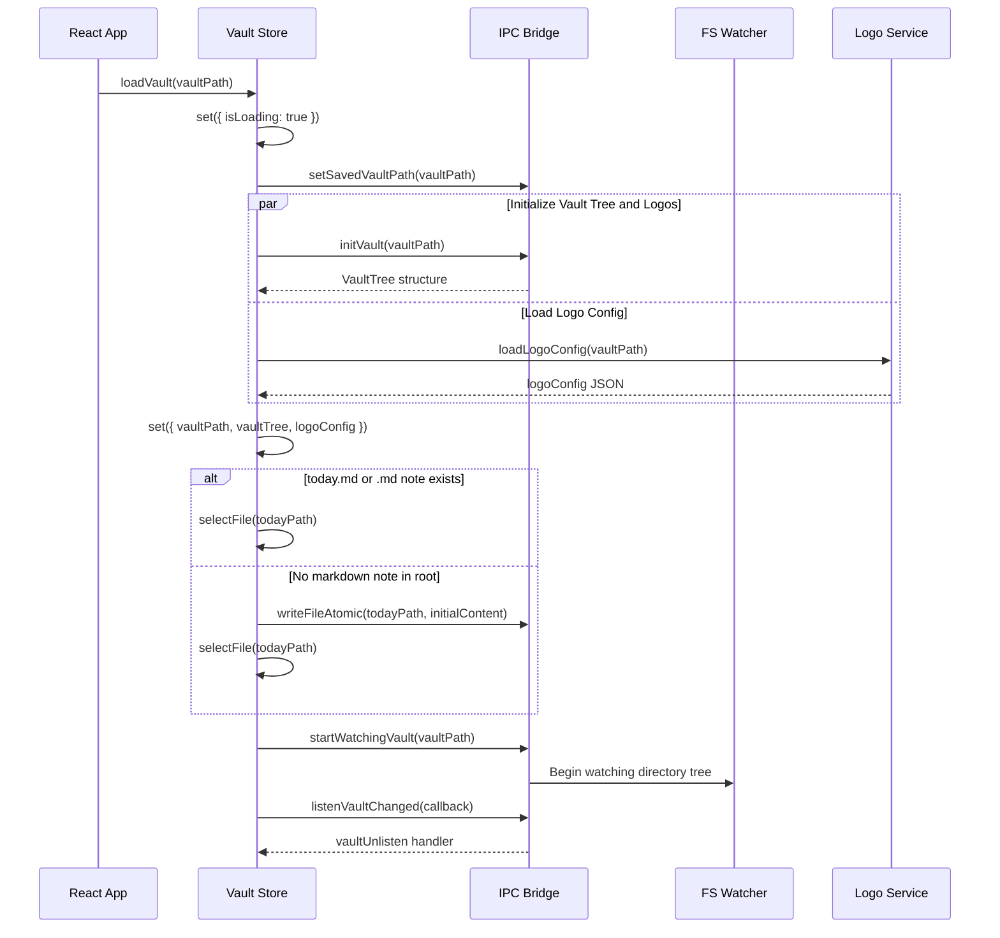
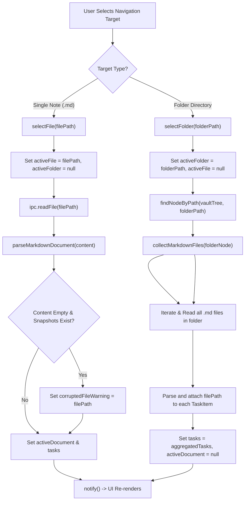
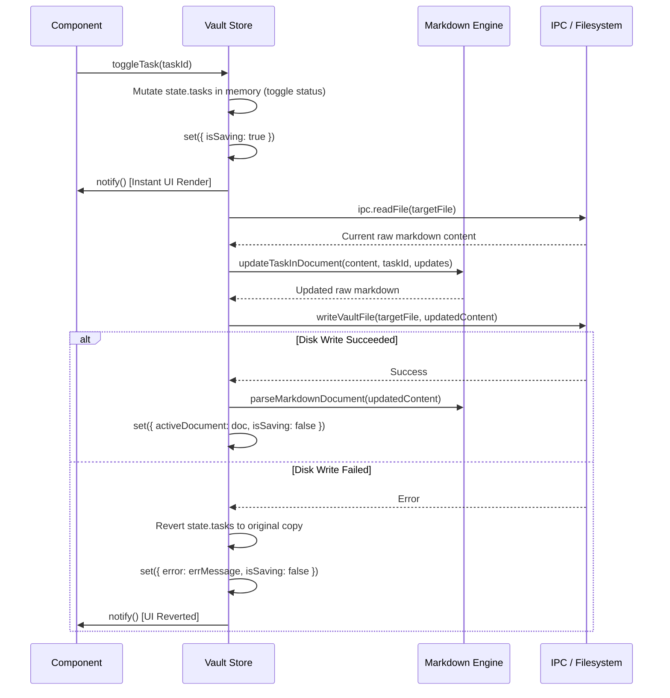

# Reactive State Management & Vault Store

QuietFlow employs a lightweight, zero-dependency reactive state management system designed specifically for local markdown task vaults. Rather than relying on heavy external state management frameworks, QuietFlow combines a native JavaScript singleton store with React 18's `useSyncExternalStore` hook (`src/store/vaultStore.ts`). This architecture guarantees synchronous state updates, fine-grained UI re-rendering via component selectors, atomic disk synchronization, and real-time reconciliation with file watcher events.

---

## Centralized Store Architecture

The core vault store manages both data state (`VaultStoreState`) and operational methods (`VaultStoreActions`), defined in `src/store/types.ts`. The store acts as the single source of truth for vault navigation trees, active file documents, aggregated folder task lists, view/filter preferences, and folder branding configurations.

```
                              ┌──────────────────────────────────┐
                              │    React Components / Hooks      │
                              └────────────────┬─────────────────┘
                                               │ useSyncExternalStore(subscribe, selector)
                                               ▼
┌──────────────────────────────────────────────────────────────────────────────────────────┐
│                                    useVaultStore                                         │
│                                                                                          │
│  ┌─────────────────────────────────────┐      ┌───────────────────────────────────────┐  │
│  │          VaultStoreState            │      │           VaultStoreActions           │  │
│  ├─────────────────────────────────────┤      │───────────────────────────────────────┤  │
│  │ vaultPath / vaultTree               │      │ loadVault() / refreshVault()          │  │
│  │ activeFile / activeFolder           │      │ selectFile() / selectFolder()         │  │
│  │ activeDocument / tasks              │      │ toggleTask() / updateTask()           │  │
│  │ activeTaskId                        │      │ addTask() / deleteTask() / moveTask() │  │
│  │ searchQuery / activeView ('list'|'kanban') │ setSearchQuery() / setActiveView()   │  │
│  │ selectedTag / selectedPriority      │      │ setFolderIcon() / getFolderIcon()     │  │
│  │ logoConfig / snapshots              │      │ restoreSnapshotForFile()              │  │
│  └─────────────────────────────────────┘      └───────────────────────────────────────┘  │
│                                              ▲                                           │
│                                              │ set(updater) / notify()                   │
│                                              │                                           │
│  ┌───────────────────────────────────────────┴─────────────────────────────────────────┐  │
│  │ listeners: Set<() => void>                                                           │  │
│  └──────────────────────────────────────────────────────────────────────────────────────┘  │
└──────────────────────────────────────────────┬───────────────────────────────────────────┘
                                               │ IPC Bridge Calls
                                               ▼
                                ┌──────────────────────────────┐
                                │     Tauri / Rust Backend     │
                                └──────────────────────────────┘
```

### Module State and Listener Model

The store is implemented using a closed module-scoped state container:

1. **State Container**: A singleton variable `state: VaultStoreState` initialized with `INITIAL_STATE` (`src/store/vaultStore.ts#L46`).
2. **Listener Registry**: A `listeners = new Set<() => void>()` holding subscriber callbacks (`src/store/vaultStore.ts#L47`).
3. **State Mutation (`set`)**: Merges partial state updates into `state` and immediately notifies all registered listeners (`src/store/vaultStore.ts#L56-L60`).
4. **Subscription Function (`subscribe`)**: Adds a callback to `listeners` and returns an unsubscription cleanup function (`src/store/vaultStore.ts#L70-L75`).
5. **Hook Interface (`useVaultStore`)**: Uses `useSyncExternalStore(subscribe, getSnapshot, getSnapshot)` to bind state slices to React component lifecycles (`src/store/vaultStore.ts#L748-L763`).

By supporting selector parameters (`useVaultStore(selector)`), components re-render only when their targeted slice of state changes, eliminating redundant renders across task lists, kanban columns, and sidebar items.

---

## Vault Lifecycle & Filesystem Synchronization

Loading a vault triggers initial directory scanning, icon configuration retrieval, automated fallback note selection, and filesystem watcher registration.


*Vault initialization sequence including concurrent tree scanning, configuration loading, automatic note selection, and file watcher registration.*

### Self-Write Timestamp Tracking

QuietFlow performs atomic writes directly to markdown files when tasks are toggled, updated, or created. Because the operating system file watcher reports all filesystem modifications, self-initiated file writes would create feedback loops and unnecessary file re-reads if not handled carefully.

To solve this, `vaultStore.ts` implements a self-write timestamp guard:

```typescript
let lastSelfWriteTimestamp = 0;

async function writeVaultFile(filePath: string, content: string): Promise<void> {
  lastSelfWriteTimestamp = Date.now();
  await ipc.writeFileAtomic(filePath, content);
  lastSelfWriteTimestamp = Date.now();
}
```

When `listenVaultChanged` receives a filesystem change notification from the Tauri backend, it compares the current timestamp against `lastSelfWriteTimestamp`:

```typescript
vaultUnlisten = await ipc.listenVaultChanged(async (changedVaultPath) => {
  if (changedVaultPath === getState().vaultPath) {
    const isSelfWrite = Date.now() - lastSelfWriteTimestamp < 600;
    await refreshVault(); // Always refresh directory tree structure
    if (!isSelfWrite) {
      if (getState().activeFile) {
        await refreshActiveFile(); // Reload active note from disk if modified externally
      } else if (getState().activeFolder) {
        await selectFolder(getState().activeFolder!); // Re-aggregate folder tasks
      }
    }
  }
});
```

If the change occurred within 600 milliseconds of an internal write operation (`isSelfWrite === true`), active file parsing is skipped, preventing UI flicker and redundant disk reads. If an external editor modified a file (`isSelfWrite === false`), the active file or folder is re-read and parsed immediately.

---

## Active Context Lifecycle: File Mode vs. Folder Aggregation

QuietFlow supports two distinct context selection modes: **Single File Mode** (`selectFile`) and **Folder Aggregation Mode** (`selectFolder`).


*Decision tree and execution paths for single note selection vs. recursive folder task aggregation.*

### Single File Mode (`selectFile`)

When selecting a single markdown file (`src/store/vaultStore.ts#L256-L297`):
1. `activeFile` is set to `filePath` and `activeFolder` is set to `null`.
2. Raw markdown text is fetched using `ipc.readFile(filePath)`.
3. The content is parsed into AST representations using `parseMarkdownDocument(content)` from `src/core/markdown`.
4. Extracted tasks are assigned their source `filePath` and set as `state.tasks`.
5. **Corruption Check**: If `content.trim() === ''`, the store checks if backup snapshots exist via `ipc.listSnapshots`. If historical snapshots are found for a 0-byte file, `corruptedFileWarning` is set to warn the user and offer one-click snapshot restoration.

### Folder Aggregation Mode (`selectFolder`)

When selecting a directory (`src/store/vaultStore.ts#L217-L254`):
1. `activeFolder` is set to `folderPath` and `activeFile` and `activeDocument` are cleared (`null`).
2. `findNodeByPath` locates the target directory node inside `state.vaultTree`.
3. `collectMarkdownFiles` recursively scans the directory subtree to identify all contained `.md` files (`src/store/vaultStore.ts#L191-L203`).
4. Each markdown file is read and parsed. All discovered tasks are tag-stamped with their origin `filePath` and aggregated into a unified task collection in `state.tasks`.

---

## Optimistic UI Mutations & Task Operations

All task updates (`toggleTask`, `updateTask`, `addTask`, `deleteTask`, `moveTask`) follow an **optimistic UI pattern with disk fallbacks**. The store immediately mutates local memory state to provide instant visual feedback before issuing asynchronous IPC writes.

### Task Mutation Execution Flow


*Execution sequence for optimistic task mutations with error rollback.*

### Key Task Action Implementations

| Action | Memory Strategy | Disk Sync Mechanism | Rollback Behavior |
| :--- | :--- | :--- | :--- |
| `toggleTask` | Toggles status (`todo` $\leftrightarrow$ `done`), sets/clears `completedDate`. | Calls `updateTaskInDocument`, writes via `writeVaultFile`. | Reverts `state.tasks` to previous array copy on error. |
| `updateTask` | Merges `Partial<TaskItem>` into target task. | Calls `updateTaskInDocument`, writes via `writeVaultFile`. | Reverts `state.tasks` to previous array copy on error. |
| `addTask` | Appends optimistic task with temporary ID (`task-temp-*`). | Calls `addTaskToDocument`, writes via `writeVaultFile`, re-parses document. | Reverts `state.tasks` to pre-addition state on error. |
| `deleteTask` | Filters out task ID from `state.tasks`. | Calls `deleteTaskFromDocument`, writes via `writeVaultFile`. | Reverts `state.tasks` to pre-deletion state on error. |
| `moveTask` | Optimistically updates `filePath` on target task. | Deletes task from source file (`deleteTaskFromDocument`), appends to destination (`addTaskToDocument`), atomically writes both files. | Reverts `state.tasks` to original tasks on error. |

---

## Folder Logo & Emoji Customization Engine

QuietFlow enables custom visual icons for directories in the sidebar and views via `logoService.ts` and `vaultStore.ts`. Folder icons can be emojis, custom uploaded raster images (PNG, WebP, JPG), or vector SVG icons.

### Configuration Schema and Storage

Folder branding metadata is persisted inside each vault at `.logos/config.json`:

```json
{
  "Projects": "🚀",
  "Clients/Acme": "Acme.png",
  "Archive": "data:image/svg+xml;utf8,<svg>...</svg>"
}
```

Icon images are stored as physical files in `<vaultPath>/.logos/<fileName>`.

### Relative Path Normalization

All folder mappings are indexed by relative paths calculated via `getFolderRelativePath(vaultPath, folderPath)` (`src/services/logoService.ts#L43-L50`):
- Vault Root: `/MockVault` $\rightarrow$ `""`
- Subfolder: `/MockVault/Clients/Acme` $\rightarrow$ `"Clients/Acme"`

### Multi-Tiered Icon Resolution Architecture

To ensure zero-latency renders without waiting for file disk reads during startup, `resolveFolderIcon` uses a two-tier resolution strategy (`src/services/logoService.ts#L55-L121`):

1. **Fast Cache Tier (`localStorage`)**: Checks browser `localStorage` for `folder-icon-${folderPath}`. If cached, returns immediately.
2. **Configuration Tier (`config.json`)**: Looks up mapped icon string in `logoConfig`.
   - **Emoji / Data URL**: Returned directly.
   - **Tauri Native Asset URL**: In Tauri desktop runtime, calls `convertFileSrc(filePath)` to convert local disk paths into high-performance asset URLs (`asset://...`).
   - **Disk Read Fallback**: Reads raw image content via `ipc.readFile`, constructs Base64/SVG Data URLs, populates `localStorage` cache, and returns the Data URL.

```typescript
// Persisting a new folder icon
async function setFolderIcon(folderPath: string, iconDataOrEmoji: string): Promise<void> {
  const { vaultPath, logoConfig } = getState();
  if (typeof localStorage !== 'undefined') {
    localStorage.setItem(`folder-icon-${folderPath}`, iconDataOrEmoji);
  }
  const relPath = getFolderRelativePath(vaultPath, folderPath);
  set({
    logoConfig: {
      ...logoConfig,
      [relPath]: iconDataOrEmoji,
      [folderPath]: iconDataOrEmoji,
    },
  });

  if (iconDataOrEmoji.startsWith('data:') || iconDataOrEmoji.includes('<svg')) {
    await persistFolderLogo(vaultPath, folderPath, iconDataOrEmoji);
  } else {
    await persistFolderEmoji(vaultPath, folderPath, iconDataOrEmoji);
  }
}
```

---

## View Filtering & UI Integration

The store maintains global UI filtering parameters that govern view displays across `TaskList`, `KanbanBoard`, and `TaskDetailPanel`:

- **View Mode (`activeView`)**: Toggles between `'list'` and `'kanban'`.
- **Search Query (`searchQuery`)**: Text filter matched against task titles, notes, and subtasks.
- **Tag Filter (`selectedTag`)**: Filters tasks containing specific `#tag` identifiers.
- **Priority Filter (`selectedPriority`)**: Filters tasks by priority (`high`, `medium`, `low`).
- **Inspector Focus (`activeTaskId`)**: Tracks the task currently opened in the right-side `TaskDetailPanel` or full-screen detail page.

Components consume these parameters using modular selector hooks:

```typescript
// Example from KanbanBoard.tsx
const tasks = useVaultStore((state) => state.tasks);
const activeTaskId = useVaultStore((state) => state.activeTaskId);
const searchQuery = useVaultStore((state) => state.searchQuery);
const selectedPriority = useVaultStore((state) => state.selectedPriority);
const updateTask = useVaultStore((state) => state.updateTask);
```

---

## Testing & Verification

The state management system and logo service are verified by comprehensive unit tests:

1. **Vault Store Tests (`src/store/vaultStore.test.ts`)**:
   - Initial state default correctness (`src/store/vaultStore.test.ts#L51-L62`).
   - Optimistic task toggling and status reversal with atomic disk writes (`src/store/vaultStore.test.ts#L64-L143`).
   - Vault loading, auto-selection, and file watcher registration (`src/store/vaultStore.test.ts#L145-L173`).
   - Recursive folder task aggregation across multiple sub-notes (`src/store/vaultStore.test.ts#L175-L228`).
   - Markdown parsing into store state and document AST (`src/store/vaultStore.test.ts#L230-L253`).
   - Cross-file task relocation via `moveTask` (`src/store/vaultStore.test.ts#L427-L442`).

2. **Logo Service Tests (`src/services/logoService.test.ts`)**:
   - Vault relative path normalization (`src/services/logoService.test.ts#L19-L24`).
   - Config JSON loading and persistence (`src/services/logoService.test.ts#L31-L40`).
   - Emoji and Data URL resolution (`src/services/logoService.test.ts#L42-L56`).
   - `localStorage` fallback caching (`src/services/logoService.test.ts#L58-L62`).
   - Image file persistence and `.logos` directory creation (`src/services/logoService.test.ts#L64-L74`).
