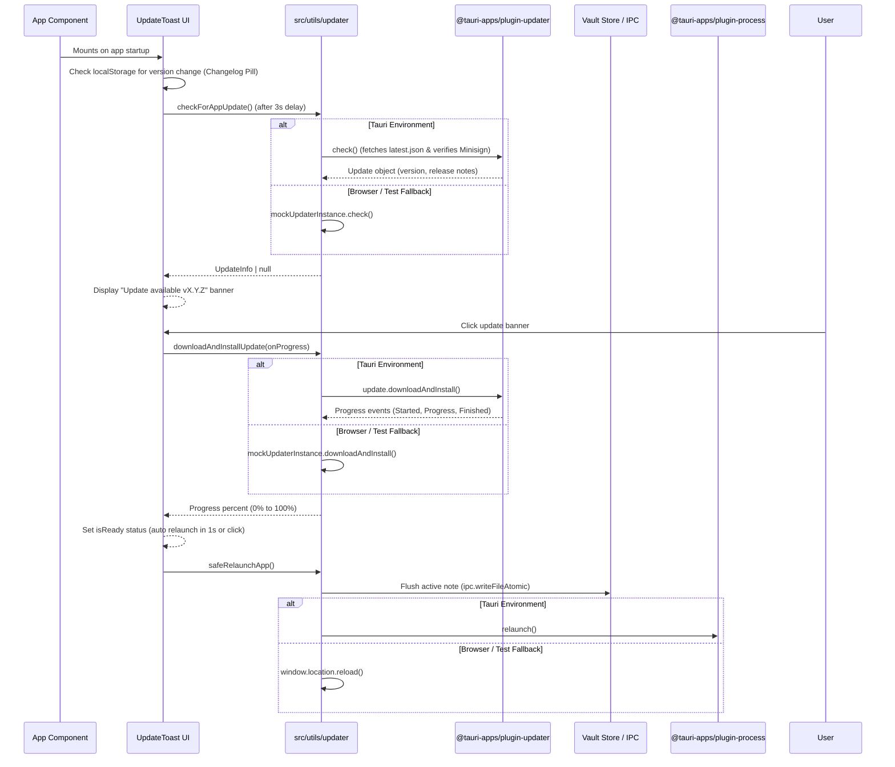

# Auto-Updater & Release Management

QuietFlow features an in-app auto-updater built on top of Tauri's official updater plugin (`@tauri-apps/plugin-updater` and `tauri-plugin-updater`). The auto-updater pipeline is designed for seamless background release checks, cryptographically verified updates, progress streaming, and zero-data-loss application restarts. For browser environments and automated test suites, the system provides a simulated mock updater fallback.

---

## Architecture & Tauri Configuration

The native desktop auto-updater is declared across Rust backend dependencies, capability grants, and Tauri bundle configuration.

```
+-------------------------------------------------------------------------+
|                              Tauri Desktop                              |
|                                                                         |
|  +--------------------+     IPC Bridge      +------------------------+  |
|  |  UpdateToast.tsx   |<------------------->| @tauri-apps/plugin-upd |  |
|  | (Top-center banner)|                     +------------------------+  |
|  +--------------------+                                 |               |
|            |                                            v               |
|            v                                +------------------------+  |
|  +--------------------+                     |  tauri-plugin-updater  |  |
|  |  updater.ts logic  |                     |     (Rust Backend)     |  |
|  +--------------------+                     +------------------------+  |
|            |                                            |               |
|            v                                            v               |
|  +--------------------+                     +------------------------+  |
|  | safeRelaunchApp()  |                     | Minisign Verification  |  |
|  | (Flushes state)    |                     | (Public Key Check)     |  |
|  +--------------------+                     +------------------------+  |
+-------------------------------------------------------------------------+
```

### Tauri Configuration & Permissions

1. **Artifact Generation & Endpoint**:
   In `src-tauri/tauri.conf.json`, the bundle settings activate update artifact generation (`createUpdaterArtifacts: true`). The updater plugin configuration registers the GitHub releases manifest endpoint:
   `https://github.com/cemendes/QuietFlow/releases/latest/download/latest.json`

2. **Cryptographic Minisign Verification**:
   To prevent binary tampering and man-in-the-middle attacks, updates are signed with Minisign. The public key is embedded in `src-tauri/tauri.conf.json` under `plugins.updater.pubkey`. Tauri verifies downloaded binaries against this signature prior to applying the update package.

3. **Backend & Capability Grants**:
   The Rust backend initializes the plugin in `src-tauri/src/lib.rs` via `.plugin(tauri_plugin_updater::Builder::new().build())`. Access rights are granted to the frontend window through `"updater:default"` in `src-tauri/capabilities/default.json`, enabling `allow-check`, `allow-download`, `allow-install`, and `allow-download-and-install`.

---

## Update Control Flow & Lifecycle

The auto-updater lifecycle manages checking for new releases, streaming download progress, flushing unwritten application data, and executing a safe process restart.


*Figure 1: End-to-end control flow for background update checks, progress streaming, zero-data-loss document flushing, and application relaunch.*

---

## Utility Functions (`src/utils/updater.ts`)

The updater utility exposes safe abstractions over Tauri's plugin APIs with silent error handling and non-desktop fallbacks.

### 1. `checkForAppUpdate()`

Queries `@tauri-apps/plugin-updater` when running in a Tauri runtime (`isTauriEnvironment()`). Returns an `UpdateInfo` object containing `version`, `currentVersion`, `body` (release notes), and `date`. Non-critical network errors or missing release manifests (e.g. `404`, `Not Found`, `could not find latest`, `No updates`) are caught silently and resolved as `null`. In non-Tauri environments, it delegates to `mockUpdaterInstance.check()`.

### 2. `downloadAndInstallUpdate(onProgress?)`

Invokes `update.downloadAndInstall()` while listening to event hooks:
- **`Started`**: Records total byte size (`contentLength`) and emits `0%` progress.
- **`Progress`**: Accumulates chunk byte counts (`chunkLength`), calculates percentage (`Math.round((downloaded / total) * 100)`), and executes the `onProgress` callback.
- **`Finished`**: Emits `100%` progress once byte transfer and signature verification complete.

If a Minisign signature mismatch occurs (e.g. corrupted payload or signature mismatch), the plugin rejects the operation with an explicit error.

### 3. `safeRelaunchApp()` (Zero-Data-Loss Safe Relaunch)

To prevent data corruption or loss of unsaved editor content during updates, `safeRelaunchApp()` flushes active state prior to restarting:
1. Obtains `activeFile` from `useVaultStore.getState()`.
2. Reads current document content via IPC (`ipc.readFile(activeFile)`).
3. Writes document contents to disk atomically using `ipc.writeFileAtomic(activeFile, content)`.
4. Triggers native app relaunch via `@tauri-apps/plugin-process`'s `relaunch()`, or executes `window.location.reload()` in browser fallback mode.

---

## User Interface (`src/components/updater/UpdateToast.tsx`)

The `UpdateToast` component mounts inside `App.tsx` and renders compact top-center floating pill notifications positioned over the title bar area.

### Visual States & Interactions

| State | Appearance & Banner Text | User Action / Trigger |
| :--- | :--- | :--- |
| **Post-Update Changelog** | Dark Slate pill with emerald icon: `Updated to v0.1.0-alpha.4 · See changelog` | Opens `CHANGELOG.md` URL in external browser. Dismissible via `X`. |
| **Update Available** | Slate/Indigo pill with pulsing sparkles: `Update available · vX.Y.Z (Click to update)` | Triggered 3s after startup. Clicking starts download process. |
| **Downloading** | Dark Slate pill with animated spinner: `Updating... X%` + progress bar | Shows live progress percentage. Banner click ignored during download. |
| **Ready for Relaunch** | Emerald pill with check icon: `Restarting to apply vX.Y.Z...` | Triggers `safeRelaunchApp()` immediately or auto-relaunches after 1 second. |
| **Error / Signature Failure** | Rose red pill: `[Error Message] (Click to retry)` | Clicking clears error state and retries `downloadAndInstallUpdate`. |

### Post-Update Changelog Pill Logic

When the app launches, `UpdateToast` checks `localStorage.getItem('quietflow-last-seen-version')`. If `lastSeenVersion` exists and differs from `CURRENT_VERSION` (`0.1.0-alpha.4`), it presents an "Updated to vX.Y.Z" changelog pill and updates `localStorage` with `CURRENT_VERSION`.

---

## Browser Mock Updater & Development Simulation

For browser development, testing, and continuous integration, `src/utils/updater.ts` exports `MockUpdater` and `mockUpdaterInstance`.

### Mock Capabilities

- **State Configuration**: `mockUpdaterInstance.setMockState({ available, version, notes, corrupt })` allows tests to set mock version strings, release notes, or simulate signature corruptions.
- **Progress Simulation**: Simulates downloading a 12 MB payload across four progress increments (`10%`, `35%`, `70%`, `100%`) with 20ms delay pauses.
- **Signature Failure Simulation**: When `corrupt: true` is set, `downloadAndInstall` throws `"Minisign signature mismatch: signature is invalid or file is corrupted."`.

---

## Automated Test Coverage

The updater pipeline is thoroughly tested in `tests/updater/updater-simulation.test.ts` using Vitest:

- **Scenario A (Update Available & Progress Streaming)**: Verifies `checkForAppUpdate()` returns version `0.2.0-alpha.1` and `downloadAndInstallUpdate()` streams progress callbacks through `[10%, 35%, 70%, 100%]`.
- **Scenario B (Up-to-Date App)**: Confirms `checkForAppUpdate()` returns `null` when no update is available.
- **Scenario C (Corrupted Minisign Signature)**: Verifies that a tampered signature causes `downloadAndInstallUpdate()` to reject with a Minisign mismatch exception.
- **Scenario D (Zero-Data-Loss Relaunch)**: Mocks active vault document state in `useVaultStore` and asserts that document flushing completes successfully prior to calling `window.location.reload()`.
