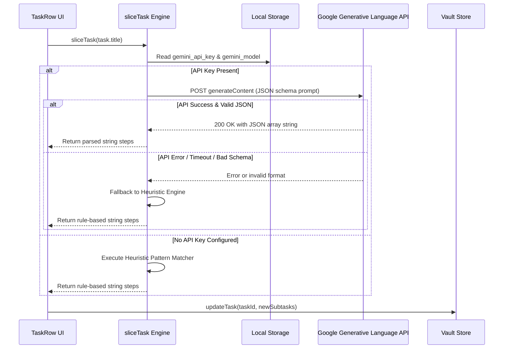
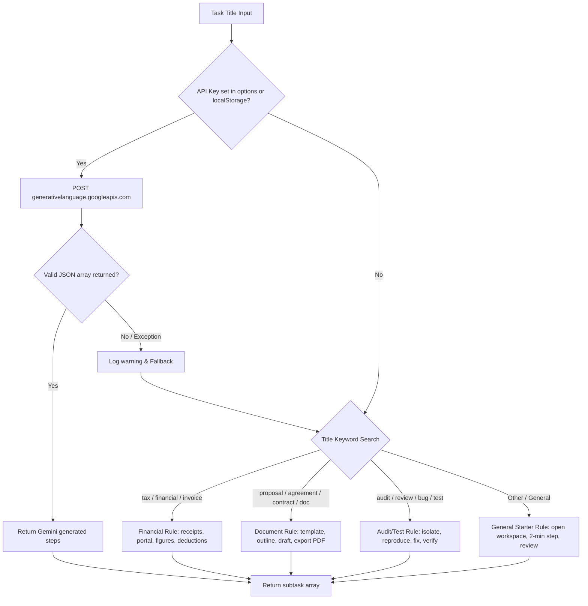

# Gemini AI Magic Slicer Integration

The **Magic Slicer** is QuietFlow's task decomposition engine designed to overcome executive dysfunction, task initiation paralysis, and cognitive overwhelm. When presented with a monolithic task (e.g., "Prepare Annual Tax Return" or "Draft Master Service Agreement"), the Magic Slicer breaks the item down into 3 to 5 low-friction, actionable Markdown subtasks.

The breakdown engine supports a dual-mode strategy: an online mode powered by the Google Generative Language API (using Gemini Flash models) and a zero-latency, local-first offline heuristic engine that uses rule-based pattern matching when no API key is provided or when network requests fail.

---

## Core Architecture & Responsibilities

Task breakdown logic is encapsulated in `src/utils/slicer.ts` and interfaced directly by QuietFlow's task components and preferences system.

```
┌─────────────────────────────────────────────────────────────────┐
│                     User Action (TaskRow)                       │
└────────────────────────────────┬────────────────────────────────┘
                                 │ Wand2 Button Click
                                 ▼
┌─────────────────────────────────────────────────────────────────┐
│              sliceTask(taskTitle, options) Engine               │
│                    (src/utils/slicer.ts)                        │
└───────────────┬─────────────────────────────────┬───────────────┘
                │                                 │
     API Key    │                                 │ No API Key /
    Available   │                                 │ API Failure
                ▼                                 ▼
┌───────────────────────────────┐ ┌───────────────────────────────┐
│ Google Generative Language API│ │  Offline Heuristic Slicer     │
│ (gemini-2.5 / gemini-3.7)     │ │  (Pattern Matching Engine)    │
└───────────────┬───────────────┘ └───────────────┬───────────────┘
                │                                 │
                └────────────────┬────────────────┘
                                 │ Array of step strings
                                 ▼
┌─────────────────────────────────────────────────────────────────┐
│                 Vault Store Task Update                         │
│               updateTask(taskId, subtasks)                      │
└─────────────────────────────────────────────────────────────────┘
```

### Component Roles

1. **`src/utils/slicer.ts`**: The core breakdown function `sliceTask`. It manages API credential discovery, constructs the prompt payload, dispatches the HTTP fetch call to Google Generative Language API, parses JSON response arrays, and provides the offline fallback rule sets.
2. **`src/components/tasks/TaskRow.tsx`**: Renders the inline 1-click **Magic Slicer** (`Wand2`) action button, triggers asynchronous task decomposition, displays an animated loading spinner during execution, and appends returned subtasks to the task in the vault store.
3. **`src/components/settings/SettingsModal.tsx`**: Provides the UI for configuring the Google Gemini API key (`gemini_api_key`) and selecting the Gemini model variant (`gemini_model`), persisting configurations locally in `localStorage`.
4. **`src/components/editor/TaskDetailPanel.tsx`**: Displays the active subtask checklist, allowing users to view, toggle, delete, or manually add subtasks generated by the slicer.

---

## Workflow & Data Flow

When a user initiates task slicing on a task row, the engine attempts online resolution before falling back to local heuristic rules.


*Sequence flow showing task slicing request routing through API execution, error trapping, heuristic fallback, and vault state updates.*

---

## Google Generative Language API Integration

When an API key is present in `SlicerOptions` or `localStorage`, `sliceTask` calls the Google Generative Language REST API.

### Credential & Model Resolution

`sliceTask` resolves configuration in the following order:

* **API Key**: `options.apiKey` || `localStorage.getItem('gemini_api_key')` || `''`
* **Model Variant**: `options.model` || `localStorage.getItem('gemini_model')` || `'gemini-2.5-flash'`

Supported model choices exposed in settings include:
* `gemini-2.5-flash`: Recommended for high speed and low latency.
* `gemini-3.7-flash`: Selected for advanced reasoning on complex task titles.

### HTTP Endpoint & Request Format

* **URL Endpoint**: `https://generativelanguage.googleapis.com/v1beta/models/${model}:generateContent?key=${apiKey.trim()}`
* **Method**: `POST`
* **Content-Type**: `application/json`

```json
{
  "contents": [
    {
      "parts": [
        {
          "text": "You are an ADHD executive dysfunction task breakdown specialist.\nBreak down the following task into 3 to 5 tiny, ultra-low-friction, concrete action steps that take under 5 minutes to begin.\nReturn ONLY a raw JSON array of strings, with no markdown formatting and no conversational filler.\nTask: \"<TASK_TITLE>\""
        }
      ]
    }
  ],
  "generationConfig": {
    "temperature": 0.2,
    "responseMimeType": "application/json"
  }
}
```

### Executive Dysfunction Prompt Design

The system prompt is explicitly engineered to aid executive function:
1. **Persona**: Configures the model as an "ADHD executive dysfunction task breakdown specialist".
2. **Granularity**: Demands 3 to 5 tiny, sub-5-minute starter steps to eliminate initiation friction.
3. **Structured Response**: Uses `generationConfig.responseMimeType = 'application/json'` combined with strict instructions to return strictly a raw JSON array of strings with zero conversational filler or markdown wrapping.
4. **Low Temperature**: Sets `temperature: 0.2` for deterministic, practical output.

### Response Parsing & Validation

Upon receiving a `200 OK` response, the engine extracts the payload string from `data?.candidates?.[0]?.content?.parts?.[0]?.text`. It runs `JSON.parse()`, verifies that the output is a non-empty array, and normalizes items into trimmed non-empty strings.

---

## Offline Heuristic Fallback Engine

If no API key is set, or if an HTTP error, network timeout, or invalid JSON payload occurs, `sliceTask` catches the failure, logs a console warning, and executes the rule-based heuristic slicer.


*Decision flow of the Magic Slicer engine from API invocation to keyword-based heuristic fallback selection.*

### Rule Sets & Keyword Pattern Matching

The heuristic engine evaluates `taskTitle.toLowerCase()` against three domain-specific keyword clusters before defaulting to a general starter template:

| Domain | Matching Keywords | Generated Checklist Steps |
| :--- | :--- | :--- |
| **Financial & Tax** | `tax`, `financial`, `invoice` | 1. Gather relevant receipts and documents from email<br/>2. Open online tax or accounting portal<br/>3. Review and enter primary figures<br/>4. Double check deductions and submit |
| **Documents & Agreements** | `proposal`, `agreement`, `contract`, `doc` | 1. Open document draft template<br/>2. Outline key deliverables and terms<br/>3. Draft core sections and review pricing<br/>4. Export PDF and send for review |
| **Audit & Quality Assurance** | `audit`, `review`, `bug`, `test` | 1. Isolate specific issue or scope checklist<br/>2. Run verification reproduction steps<br/>3. Apply necessary fixes or corrections<br/>4. Confirm tests pass and document outcome |
| **General Starter Template** | *Default fallback for any unmatched task title* | 1. Open relevant workspace and gather materials for "`<taskTitle>`"<br/>2. Complete the first 2-minute starter action<br/>3. Review progress and execute remaining step |

---

## UI Trigger Points & Component Integration

### 1. Task Row Magic Slice Action (`src/components/tasks/TaskRow.tsx`)

In `TaskRow.tsx`, each task row presents a hover action group containing the `Wand2` Magic Slicer button (`data-testid="task-slice-${task.id}"`).

```typescript
const [isSlicing, setIsSlicing] = useState(false);
const updateTask = useVaultStore((state) => state.updateTask);

const handleMagicSlice = async (e: React.MouseEvent) => {
  e.stopPropagation();
  if (isSlicing) return;
  setIsSlicing(true);

  try {
    const generatedSteps = await sliceTask(task.title);
    const existingSubtasks = task.subtasks || [];
    const newSubtasks = [
      ...existingSubtasks,
      ...generatedSteps.map((step, idx) => ({
        id: `subtask-${Date.now()}-${idx}`,
        title: step,
        status: 'todo' as const,
      })),
    ];

    await updateTask(task.id, { subtasks: newSubtasks });
  } catch (err) {
    console.error('Failed to slice task:', err);
  } finally {
    setIsSlicing(false);
  }
};
```

While slicing is active, `isSlicing` applies the `animate-spin` CSS class to the wand icon to provide immediate visual feedback. Upon completion, subtask items are assigned unique IDs (`subtask-${Date.now()}-${idx}`) with `status: 'todo'` and preserved alongside existing subtasks.

### 2. Settings Modal AI Configuration (`src/components/settings/SettingsModal.tsx`)

The **Preferences** modal includes an **AI & Magic Slicer** tab (`TabType = 'ai'`) allowing users to configure API credentials and select the preferred model.

* **Google Gemini API Key Input**: `<input type="password" id="gemini-key-input">` bound to state `geminiApiKey`. Stored in `localStorage` under `gemini_api_key`.
* **Gemini Model Selector**: `<select id="gemini-model-select">` with options `gemini-2.5-flash` and `gemini-3.7-flash`. Stored in `localStorage` under `gemini_model`.
* **Local Privacy**: API keys remain strictly local in the user's browser or Tauri webview storage and are never transmitted to third-party telemetry services.

### 3. Task Detail Subtask Panel (`src/components/editor/TaskDetailPanel.tsx`)

Once subtasks are generated by `sliceTask` and committed to the store, `TaskDetailPanel` renders the subtask checklist with completion ratios (e.g., `2/4`), check/uncheck toggle handlers, subtask deletion buttons, and a quick-add input line for manual subtask creation.

---

## Failure Semantics & Resilience Invariants

1. **Zero Configuration Requirement**: QuietFlow works out-of-the-box without requiring an API key. Slicing immediately produces heuristic subtasks offline.
2. **Network Resilience**: API network failures, HTTP non-200 responses, or unexpected response schemas are caught inside `sliceTask` via a `try/catch` block. The error is logged as a console warning, and execution seamlessly completes using the offline heuristic generator without breaking the UI flow.
3. **Subtask Preservation**: When `TaskRow` invokes `sliceTask`, newly generated subtasks are concatenated with any existing subtasks, preventing accidental overwrite of existing user checklist items.
4. **Local Key Storage**: API credentials are isolated to local storage (`gemini_api_key`), keeping vault operations local-first.

---

## Verification & Testing

The Magic Slicer suite is verified in `src/utils/slicer.test.ts` using Vitest:

* **Heuristic Financial Test**: Verifies that `sliceTask('Prepare Annual Tax Return')` returns at least 3 steps containing financial domain terms like `'receipts'`.
* **Heuristic Document Test**: Verifies that `sliceTask('Draft Master Service Agreement')` returns document starter steps.
* **API Integration Test**: Mocks `global.fetch` to return a sample candidate response (`['Find W2 form in email', 'Log into TurboTax', 'Fill in income']`) and confirms `sliceTask('Do my taxes', { apiKey: 'AIzaFakeKey' })` accurately parses and returns the candidate step array.
