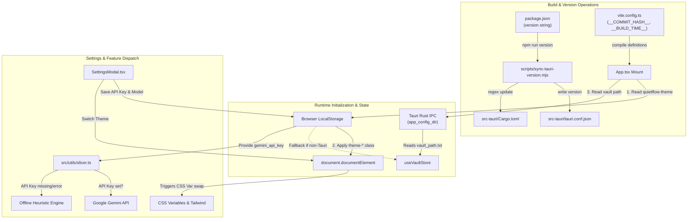

# Configuration, Themes & Build Operations

QuietFlow is designed as a calm, local-first, privacy-respecting desktop application. Its configuration management and operations architecture guarantees zero cloud lock-in, zero telemetry, and instant local execution.

Configuration state in QuietFlow is managed through a dual-layer strategy: native configuration files handled by the Tauri v2 Rust core on desktop platforms, and `localStorage` persistence handled by the React frontend for interface preferences, layout metrics, folder icon caches, and AI integrations.

---

## System Architectural Flow

The following diagram illustrates how user preferences, native IPC defaults, build definitions, and theme styling flow through QuietFlow at runtime and during release operations:



---

## Persistence Model & Local Storage Inventory

QuietFlow uses `localStorage` for client-side preference persistence, UI layout dimensions, and folder logo caching. On native desktop builds, critical system configurations (such as the active vault path) are saved to disk by the Rust backend in `vault_path.txt` within the OS application configuration directory (`app_config_dir()`, e.g., `~/Library/Application Support/QuietFlow/vault_path.txt` on macOS).

### Local Storage Key Reference

| Key Name | Data Type | Default Value | Owner / Component | Purpose & Operational Behavior |
| :--- | :--- | :--- | :--- | :--- |
| `quietflow-theme` | `string` | `'warm-paper'` | `SettingsModal.tsx`, `App.tsx` | Stores active visual theme (`'warm-paper'`, `'nordic-slate'`, `'forest-moss'`). Applied as a class on `<html>`. |
| `quietflow-vault-path` | `string` | `'/MockVault'` | `ipc.ts`, `vaultStore.ts` | Remembers the selected local Markdown vault folder path in web or browser fallback environments. |
| `gemini_api_key` | `string` | `''` | `SettingsModal.tsx`, `slicer.ts` | Google Gemini API key used by the Magic Slicer task auto-breaker. Stored strictly on local device. |
| `gemini_model` | `string` | `'gemini-2.5-flash'` | `SettingsModal.tsx`, `slicer.ts` | Configured Gemini model (`'gemini-2.5-flash'` for speed, `'gemini-3.7-flash'` for advanced reasoning). |
| `quietflow-sidebar-width` | `number` | `260` | `Sidebar.tsx` | Remembers drag-resized sidebar width in pixels for layout continuity across sessions. |
| `quietflow-panel-width` | `number` | `480` | `TaskDetailPanel.tsx` | Remembers right-side task detail panel width in pixels. |
| `quietflow-last-active-file` | `string` | `null` | `BreadcrumbBanner.tsx` | Tracks the relative path of the last opened Markdown document for session recovery banners. |
| `quietflow-last-active-time` | `string` | `null` | `BreadcrumbBanner.tsx` | Unix timestamp recording the last active document interaction time. |
| `quietflow-last-seen-version` | `string` | `null` | `UpdateToast.tsx` | Application version recorded when an update announcement toast has been viewed or dismissed. |
| `folder-icon-${folderPath}` | `string` | `null` | `logoService.ts`, `FolderItem.tsx` | Caches assigned emoji or base64 SVG/image data URL for instant zero-latency folder logo rendering. |

---

## Dynamic Theme System & CSS Variable Architecture

QuietFlow features three distinct, carefully tuned color themes designed to promote focus and reduce visual fatigue. Themes are driven by CSS custom properties defined in `src/index.css` and mapped into Tailwind CSS utility classes in `tailwind.config.js`.

### Theme Switching Mechanics

When a user selects a theme in `SettingsModal.tsx`, the `applyTheme` function:
1. Updates the active theme state.
2. Writes the selection to `localStorage.setItem('quietflow-theme', themeName)`.
3. Removes existing theme class names (`theme-warm-paper`, `theme-nordic-slate`, `theme-forest-moss`) from `document.documentElement`.
4. Adds the new `theme-${themeName}` class to `document.documentElement`.

During application startup, `App.tsx` reads `quietflow-theme` from `localStorage` in a top-level `useEffect` hook and immediately attaches the corresponding `theme-*` class to `document.documentElement`, ensuring zero theme flickering on startup.

```typescript
// Theme application mechanism in SettingsModal.tsx
const applyTheme = (themeName: 'warm-paper' | 'nordic-slate' | 'forest-moss') => {
  setSelectedTheme(themeName);
  localStorage.setItem('quietflow-theme', themeName);
  document.documentElement.classList.remove('theme-warm-paper', 'theme-nordic-slate', 'theme-forest-moss');
  document.documentElement.classList.add(`theme-${themeName}`);
};
```

### Available Themes & Color Palettes

1. **Warm Sand & Forest (`theme-warm-paper`) — Default**:
   - Background App: `#FAF9F6` (soft linen paper)
   - Sidebar Background: `#F5F3EF` (warm sand)
   - Text Primary: `#1E293B`
   - Accent Color: `#065F46` (calming evergreen)
2. **Nordic Minimalist (`theme-nordic-slate`)**:
   - Background App: `#F8FAFC` (cool slate tint)
   - Sidebar Background: `#F1F5F9` (light slate)
   - Text Primary: `#0F172A`
   - Accent Color: `#0F172A` (high-contrast dark slate)
3. **Deep Moss Dark Mode (`theme-forest-moss`)**:
   - Background App: `#061A14` (midnight forest)
   - Sidebar Background: `#09261D` (deep moss)
   - Text Primary: `#ECFDF5` (bright mint)
   - Accent Color: `#10B981` (emerald green)

### Tailwind CSS Mapping

`tailwind.config.js` connects custom CSS variables directly to Tailwind color classes:

```javascript
/** @type {import('tailwindcss').Config} */
export default {
  content: ['./index.html', './src/**/*.{js,ts,jsx,tsx}'],
  theme: {
    extend: {
      colors: {
        sand: {
          50: 'var(--bg-app)',
          100: 'var(--bg-sidebar)',
          200: 'var(--border-color)',
          300: 'var(--border-color)',
        },
        forest: {
          50: 'var(--accent-light)',
          100: 'var(--accent-light)',
          500: 'var(--accent-color)',
          600: 'var(--accent-color)',
          700: 'var(--accent-color)',
          800: 'var(--accent-hover)',
          900: 'var(--accent-hover)',
        },
      },
    },
  },
  plugins: [],
};
```

---

## Gemini AI & Magic Slicer Configuration

QuietFlow integrates Google Generative AI to power the **Magic Slicer**, a tool that decomposes complex tasks into 3 to 5 low-friction subtasks taking under 5 minutes each.

### Configuration Options

In `SettingsModal.tsx` under the **AI & Magic Slicer** tab, users can configure:
- **Google Gemini API Key**: Stored in `localStorage` under `gemini_api_key`. Keys remain strictly on the user's local machine and are sent directly to Google API endpoints without intermediate proxy servers.
- **Gemini Model**: Stored in `localStorage` under `gemini_model`. Supported choices:
  - `gemini-2.5-flash`: Default recommended model for ultra-fast response times.
  - `gemini-3.7-flash`: Advanced model for complex reasoning and nuanced breakdowns.

### Heuristic Fallback Engine

In `src/utils/slicer.ts`, the `sliceTask` function reads the API key and model setting. If no API key is present, or if network/API errors occur, QuietFlow seamlessly falls back to an offline rule-based heuristic engine:

```typescript
export async function sliceTask(taskTitle: string, options: SlicerOptions = {}): Promise<string[]> {
  const apiKey = options.apiKey || (typeof window !== 'undefined' ? localStorage.getItem('gemini_api_key') || '' : '');
  const model = options.model || (typeof window !== 'undefined' ? localStorage.getItem('gemini_model') || 'gemini-2.5-flash' : 'gemini-2.5-flash');

  if (apiKey.trim()) {
    try {
      const endpoint = `https://generativelanguage.googleapis.com/v1beta/models/${model}:generateContent?key=${apiKey.trim()}`;
      const response = await fetch(endpoint, { /* POST payload with JSON response mode */ });
      if (response.ok) {
        const data = await response.json();
        // Return parsed AI subtasks
      }
    } catch (err) {
      console.warn('Gemini API call failed, falling back to heuristic slicer:', err);
    }
  }

  // Offline Heuristic Engine: Instant rule-based scaffolding
  const lower = taskTitle.toLowerCase();
  if (lower.includes('tax') || lower.includes('financial') || lower.includes('invoice')) {
    return ['Gather relevant receipts and documents', 'Open online accounting portal', 'Review and enter figures', 'Double check deductions and submit'];
  }
  // Standard starter step fallback...
}
```

---

## Build Operations & Version Synchronization

QuietFlow maintains strict version synchronization across Node, Tauri desktop configuration, and Rust crate metadata.

### Version Synchronization Script (`sync-tauri-version.mjs`)

When bumping versions via `npm version <major|minor|patch>`, npm triggers the `version` script defined in `package.json`. This executes `scripts/sync-tauri-version.mjs`, which:
1. Reads the target version string from `package.json`.
2. Reads `src-tauri/tauri.conf.json`, sets `tauriConf.version = newVersion`, and writes the formatted JSON back to disk.
3. Reads `src-tauri/Cargo.toml` and performs regex replacement on the package `version = "..."` entry.
4. Stage changes in Git (`git add src-tauri/tauri.conf.json src-tauri/Cargo.toml`).

```javascript
// scripts/sync-tauri-version.mjs snippet
const packageJson = JSON.parse(fs.readFileSync(packageJsonPath, 'utf8'));
const newVersion = packageJson.version;

// Update tauri.conf.json
const tauriConf = JSON.parse(fs.readFileSync(tauriConfPath, 'utf8'));
tauriConf.version = newVersion;
fs.writeFileSync(tauriConfPath, JSON.stringify(tauriConf, null, 2) + '\n', 'utf8');

// Update Cargo.toml
let cargoToml = fs.readFileSync(cargoTomlPath, 'utf8');
cargoToml = cargoToml.replace(/^version = ".*?"/m, `version = "${newVersion}"`);
fs.writeFileSync(cargoTomlPath, cargoToml, 'utf8');
```

### NPM Lifecycle & Release Gatekeeper

`package.json` defines preversion gatekeepers and build commands to protect release integrity:

```json
{
  "scripts": {
    "dev": "vite",
    "build": "tsc && vite build",
    "test": "vitest run",
    "test:rust": "cargo test --manifest-path src-tauri/Cargo.toml",
    "test:e2e": "playwright test",
    "test:autonomous": "playwright test tests/e2e/autonomous-menu-crawler.spec.ts",
    "preversion": "npm run test:rust && npm run build && npm run test && npm run test:autonomous",
    "version": "node scripts/sync-tauri-version.mjs && git add src-tauri/tauri.conf.json src-tauri/Cargo.toml"
  }
}
```

### Vite Build Environment & Defines

`vite.config.ts` configures compile-time constants and forces strict dev server porting:
- **Port**: Fixed to `1420` (`strictPort: true`) matching Tauri `devUrl` requirements (`http://localhost:1420`).
- **Defines**:
  - `__COMMIT_HASH__`: Extracted dynamically using `git rev-parse --short HEAD` (or `'local'`).
  - `__BUILD_TIME__`: ISO build timestamp string.

---

## Automated Verification & Settings Testing

To ensure theme application, preferences storage, and settings navigation remain rock-solid across updates, QuietFlow includes an automated Playwright journey script (`scripts/settings-journey.mjs`).

The script launches an isolated browser context, opens the preferences modal, iterates across all theme options (`Nordic Minimalist`, `Deep Moss Dark Mode`, and `Warm Sand`), and verifies:
- `document.documentElement` class list reflects `theme-nordic-slate`, `theme-forest-moss`, or `theme-warm-paper`.
- Computed `window.getComputedStyle(document.body).backgroundColor` matches the expected RGB values.
- Form controls for vault location, AI keys, and keyboard shortcut lists render without console errors.

Additionally, unit tests in `src/utils/slicer.test.ts` and `src/services/logoService.test.ts` validate `localStorage` key reads and fallback handling.
