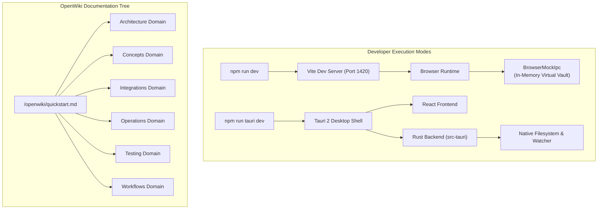

# Developer Quickstart & Information Architecture

Welcome to the **QuietFlow** developer documentation. QuietFlow is a calm, local-first task and notes manager built with **React 18**, **TypeScript**, **Tailwind CSS**, and **Tauri 2** (Rust). It stores task and note data directly in plain text Markdown files on the local filesystem, combining local data sovereignty with specialized cognitive accessibility features such as "One-Thing" Zen Theater, Gemini AI task breakdown, and breadcrumb navigation.

This guide provides an immediate onboarding path for developers, covering local development setup, runtime modes, repository structure, test automation pipelines, release management, and the overall OpenWiki documentation layout.

---

## System Architecture & Runtime Modes

QuietFlow operates under a local-first design pattern where the source of truth is a folder of standard Markdown (`.md`) files on the host machine. To balance fast frontend developer iteration with robust desktop filesystem access, QuietFlow supports two distinct runtime execution modes:

1. **Browser Web Mode (`npm run dev`)**: Launches a Vite hot-reloading web application server on `http://localhost:1420`. In web mode, QuietFlow uses `BrowserMockIpc` to simulate filesystem read/write, directory indexing, and snapshot management entirely in memory with pre-seeded Markdown notes. This allows rapid UI and component development without requiring Rust tools or compiling native desktop binaries.
2. **Native Desktop Shell (`npm run tauri dev`)**: Launches the Tauri 2 desktop container, combining the Vite frontend webview with the native Rust backend (`src-tauri`). In native mode, IPC commands invoke compiled Rust routines for atomic file writes (`write_file_atomic`), directory tree compilation (`init_vault`), debounced native file watcher events via `notify` (`start_watching_vault`), local pre-write safety backups in `.quietflow/snapshots`, and OS folder pickers.


*Developer execution modes and OpenWiki documentation routing structure.*

---

## Prerequisites & Quickstart Setup

### Environment Requirements

Before setting up QuietFlow locally, ensure your machine meets the following environment prerequisites:

- **Node.js**: `v18.0.0` or higher
- **npm**: `v9.0.0` or higher
- **Rust**: `v1.75.0` or higher (required for native desktop development and `cargo test`)
- **System Dependencies**: Standard C toolchain and OS desktop dev libraries (such as `webkit2gtk` on Linux).

### Step-by-step Quickstart

1. **Clone the repository**:
   ```bash
   git clone https://github.com/cemendes/QuietFlow.git
   cd QuietFlow
   ```

2. **Install JavaScript dependencies**:
   ```bash
   npm install
   ```

3. **Launch Web Mode (Browser Hot Reload)**:
   ```bash
   npm run dev
   ```
   Open `http://localhost:1420` in any web browser. The app initializes with a pre-seeded virtual vault (`/MockVault`).

4. **Launch Desktop Mode (Native Tauri App)**:
   ```bash
   npm run tauri dev
   ```
   Compiles the native Rust backend in `src-tauri` and launches the desktop window.

---

## Initial Vault Resolution Flow

Upon application startup in `src/App.tsx`, the `initDefaultVault` procedure resolves the active vault directory using a fallback hierarchy:

1. **Saved Backend Config**: Queries `ipc.getSavedVaultPath()` (backed by `vault_path.txt` in app config directory).
2. **Saved Browser Storage**: Checks `localStorage.getItem('quietflow-vault-path')`.
3. **Current Store State**: Falls back to `vaultPath` state in Zustand store.
4. **Default OS Vault Path**: Queries `ipc.getDefaultVaultPath()`, which resolves to `~/Documents/QuietFlowVault`.

---

## Repository Directory Structure

```
QuietFlow/
├── src/                        # React 18 frontend source code
│   ├── components/             # React UI components organized by domain
│   │   ├── archive/            # Task archive modal component
│   │   ├── breadcrumb/         # Cognitive re-entry breadcrumb banner
│   │   ├── capture/            # Global Quick Capture modal (`Cmd+N`)
│   │   ├── editor/             # Full-page Markdown editor & metadata bar
│   │   ├── history/            # File corruption warning & snapshot modal
│   │   ├── kanban/             # Drag-and-drop Kanban board & WIP limits
│   │   ├── settings/           # Settings modal & AI key management
│   │   ├── sidebar/            # Folder navigation tree & context menus
│   │   ├── tasks/              # Main Task List, Quick Add bar, View Switcher
│   │   ├── updater/            # Auto-updater notification toast
│   │   └── zen/                # "One-Thing" Zen Theater focus modal
│   ├── core/                   # Core business logic & markdown parsing
│   │   └── markdown/           # Custom task & metadata parser & serializer
│   ├── hooks/                  # Custom React hooks (e.g. `useGlobalShortcuts`)
│   ├── services/               # Auxiliary services (e.g. logo generator)
│   ├── store/                  # Centralized Zustand reactive vault store & IPC bridge
│   │   ├── ipc.ts              # IPC interface abstraction & BrowserMockIpc fallback
│   │   ├── vaultStore.ts       # Main Zustand reactive vault store
│   │   └── types.ts            # Type definitions for vault nodes and tasks
│   └── utils/                  # Utility functions (celebrations, feedback, slicer)
├── src-tauri/                  # Tauri 2 Rust desktop backend
│   ├── src/
│   │   ├── lib.rs              # Tauri command handlers & plugin builder entrypoint
│   │   ├── main.rs             # Application main entrypoint
│   │   └── vault/              # Rust vault submodules
│   │       ├── fs.rs           # Atomic file writes & recursive tree scanner
│   │       ├── fs_tests.rs     # Rust unit tests for filesystem routines
│   │       ├── snapshots.rs    # Snapshot backup creation & restoration
│   │       ├── snapshots_tests.rs # Rust unit tests for version recovery
│   │       └── watcher.rs      # Native `notify` directory watcher debouncer
│   ├── capabilities/           # Tauri plugin permissions configuration
│   └── tauri.conf.json         # Desktop application configuration & build specs
├── scripts/                    # Automation and journey testing scripts
│   ├── sync-tauri-version.mjs  # Version synchronization script
│   └── *.mjs                   # Automated journey & bug reproduction scripts
├── tests/                      # Playwright E2E and autonomous test suites
│   ├── e2e/                    # E2E integration, menu crawler, and chaos monkey tests
│   └── fixtures/               # Test fixtures and corrupt markdown samples
├── package.json                # NPM scripts and Node dependencies
├── vite.config.ts              # Vite bundle builder & Vitest test setup
└── openwiki/                   # System documentation hierarchy
```

---

## Development Scripts & Testing Commands

QuietFlow includes automated test suites and validation scripts across frontend TypeScript and backend Rust codebases.

### NPM Scripts Reference

| Script Name | Command Line | Description |
| :--- | :--- | :--- |
| `npm run dev` | `vite` | Starts Vite hot-reload dev server on port 1420 (web mock mode). |
| `npm run build` | `tsc && vite build` | Runs TypeScript compiler checks and builds Vite production bundle. |
| `npm run preview` | `vite preview` | Previews local production build output. |
| `npm run tauri` | `tauri` | Accesses Tauri CLI tool suite. |
| `npm run tauri dev` | `tauri dev` | Launches native desktop app with Tauri Rust backend. |
| `npm test` | `vitest run` | Runs all 18 Vitest unit and component test suites once. |
| `npm run test:watch` | `vitest` | Runs Vitest in interactive watch mode for TDD. |
| `npm run test:rust` | `cargo test --manifest-path src-tauri/Cargo.toml` | Executes Rust backend filesystem and snapshot test suites. |
| `npm run test:e2e` | `playwright test` | Runs Playwright E2E browser automation tests. |
| `npm run test:autonomous` | `playwright test tests/e2e/autonomous-menu-crawler.spec.ts` | Runs automated menu crawler journey spec. |
| `npm run test:chaos` | `playwright test tests/e2e/autonomous-chaos-monkey.spec.ts` | Runs Gremlins.js autonomous chaos monkey suite. |
| `npm run preversion` | `npm run test:rust && npm run build && npm run test && npm run test:autonomous` | Pre-version release gate verifying all tests and build pass before release. |
| `npm run version` | `node scripts/sync-tauri-version.mjs && git add ...` | Syncs `package.json` version into `src-tauri/tauri.conf.json` and `src-tauri/Cargo.toml`. |

---

## Release & Versioning Workflow

When bumping QuietFlow release versions, the project maintains strict synchronization between `package.json`, `src-tauri/tauri.conf.json`, and `src-tauri/Cargo.toml`.

The release lifecycle sequence follows:

1. **Preversion Gate (`npm run preversion`)**: Executes Rust unit tests (`npm run test:rust`), verifies TypeScript compilation (`npm run build`), runs frontend unit specs (`npm test`), and executes autonomous menu crawler tests (`npm run test:autonomous`).
2. **Version Bump (`npm version <patch|minor|major>`)**: NPM increments the version in `package.json` and automatically triggers the `version` lifecycle hook (`node scripts/sync-tauri-version.mjs`), which rewrites the version in `src-tauri/tauri.conf.json` and `src-tauri/Cargo.toml` and stages the modified configuration files for git commit.

---

## OpenWiki Documentation Hierarchy

The QuietFlow OpenWiki system is organized into six core functional domains:

### 1. Architecture
- **[System Architecture Overview](/openwiki/architecture/overview.md)**: High-level system design, Tauri 2 shell, React runtime, and local-first boundaries.
- **[IPC Bridge & Host Communication](/openwiki/architecture/ipc-bridge.md)**: Details `IpcInterface`, Tauri invoke bridge, native file watchers, and `BrowserMockIpc`.
- **[Tauri Native Rust Backend](/openwiki/architecture/tauri-rust-backend.md)**: Deep dive into Rust commands, atomic writes, snapshot management, and debounced file watching.

### 2. Core Concepts
- **[Reactive State Management & Vault Store](/openwiki/concepts/state-management.md)**: Centralized Zustand vault store, change notification pattern, and active view synchronization.
- **[Markdown Parsing & Serialization Engine](/openwiki/concepts/markdown-engine.md)**: Inline task syntax (`@due`, `@priority`, `#tag`), task breakdown, subtasks, frontmatter, and round-trip serialization.
- **[Snapshot Versioning & Data Recovery](/openwiki/concepts/snapshot-versioning.md)**: Pre-write backup system in `.quietflow/snapshots`, corruption warning banner, and 1-click restoration.

### 3. Integrations
- **[Gemini AI Magic Slicer Integration](/openwiki/integrations/gemini-ai-slicer.md)**: Task breakdown engine, prompt engineering for executive dysfunction, and offline fallback heuristics.
- **[Auto-Updater & Release Management](/openwiki/integrations/auto-updater.md)**: Update notification flow using `@tauri-apps/plugin-updater`, release signatures, and update toast UI.

### 4. Operations & Configuration
- **[Configuration, Themes & Build Operations](/openwiki/operations/configuration.md)**: Theme CSS variables, configuration settings, environment constants, and version sync scripts.
- **[Vault File Storage & Custom Branding](/openwiki/operations/vault-storage.md)**: Disk vault layout, folder icons/emojis, metadata folder `.quietflow`, and file operations.

### 5. Testing & Quality Assurance
- **[Testing Strategy & Autonomous QA](/openwiki/testing/test-suite.md)**: Vitest unit testing, Rust backend tests, Playwright E2E suites, and autonomous chaos monkey testing.

### 6. Workflows & User Experience
- **[Quick Capture & Global Shortcuts](/openwiki/workflows/quick-capture.md)**: OS-level hotkeys via Tauri global-shortcut plugin and browser keyboard event listeners (`Cmd+N`).
- **[Task Lifecycle & View Workflows](/openwiki/workflows/task-lifecycle.md)**: Comprehensive guide to task states across List, Kanban, and Detail views.
- **[Zen Theater Focus Mode & Dopamine Systems](/openwiki/workflows/zen-theater-focus.md)**: "One-Thing" Zen Theater, time-sweep visual aura, confetti celebrations, and Web Audio API feedback.
