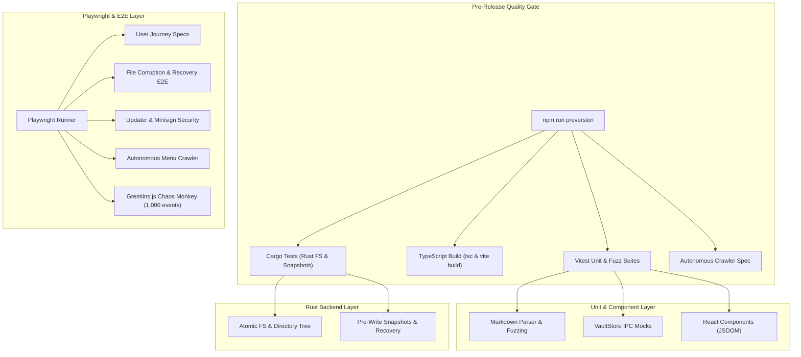

# Testing Strategy & Autonomous QA

QuietFlow implements a multi-tiered testing strategy designed to ensure desktop application reliability, non-destructive data handling, atomic filesystem operations, and resilient UI state management. Because QuietFlow reads and writes local Markdown files directly, tests cover both the TypeScript frontend and the Rust Tauri backend, supplemented by automated chaos monkey stress testing and file corruption recovery specs.


*Overview of QuietFlow test suites, verification layers, and pre-release quality gate.*

---

## Test Execution & Lifecycle

QuietFlow provides npm scripts and Cargo test commands tailored for distinct stages of development and continuous integration.

### Test Commands

| Target | Command | Responsibilities & Scope |
| :--- | :--- | :--- |
| **Unit & Store** | `npm test` (`vitest run`) | Executes frontend unit tests, markdown parser tests, store mocks, and component specs in JSDOM. |
| **Watch Mode** | `npm run test:watch` (`vitest`) | Runs Vitest in interactive watch mode for rapid test-driven development. |
| **Rust Backend** | `npm run test:rust` (`cargo test --manifest-path src-tauri/Cargo.toml`) | Executes Rust unit tests for filesystem commands, tree scanning, and snapshot generation. |
| **Playwright E2E** | `npm run test:e2e` (`playwright test`) | Runs end-to-end browser tests against Vite dev server. |
| **Autonomous Crawler** | `npm run test:autonomous` | Launches Playwright crawler to explore all UI states, modals, and context menus. |
| **Chaos Monkey** | `npm run test:chaos` | Executes Gremlins.js randomized UI stress testing. |

### Pre-Release Quality Gate

Before bumping versions, QuietFlow executes a composite pipeline defined in the `preversion` hook:

```bash
npm run test:rust && npm run build && npm run test && npm run test:autonomous
```

This enforces that:
1. Rust filesystem logic and snapshot mechanisms compile and pass.
2. The TypeScript build (`tsc && vite build`) succeeds without type or bundle errors.
3. All Vitest unit and component tests complete with zero failures.
4. The autonomous UI crawler confirms that no views or modals crash during navigation.

---

## Frontend Unit & Store Testing (Vitest)

Frontend testing uses **Vitest** paired with **React Testing Library** and `@testing-library/jest-dom`. Tests are configured in `vite.config.ts` using the `jsdom` environment and setup file `src/test/setup.ts`. E2E files (`*.spec.ts`) are explicitly excluded from the Vitest unit test run to maintain rapid execution times.

### Markdown Parser & Serializer Unit Tests

The markdown engine (`src/core/markdown/`) is responsible for non-destructive parsing and serialization of task items and frontmatter metadata.

- **Parser Functionality (`src/core/markdown/parser.test.ts`)**:
  - Validates extraction of YAML frontmatter metadata (e.g., `id`, `title`, `category`).
  - Verifies status extraction (`todo` `[ ]`, `in-progress` `[/]`, `done` `[x]`), due dates (`@due(...)`), priority (`@priority(...)`), and tags (`#tag`).
  - Confirms checkboxes inside code blocks are ignored.
  - Verifies stable task ID generation and preservation across line shifts when new tasks are prepended to a document.

- **Parser Fuzzing & Robustness (`src/core/markdown/parser.fuzz.test.ts`)**:
  - Tests malformed and unclosed YAML frontmatter, ensuring the parser gracefully falls back without throwing exceptions.
  - Verifies tasks containing email addresses, URLs with anchors (`https://quietflow.app/docs#getting-started`), and markdown links do not corrupt tag parsing.
  - Handles deeply nested subtasks up to 10 levels deep.
  - Preserves UTF-8 multi-byte characters, Japanese, Chinese, Cyrillic text, and emojis.

### Vault Store & State Management Tests

The Zustand store (`src/store/vaultStore.ts`) manages active note selection, task lists, search queries, and filesystem interaction via an IPC bridge (`src/store/ipc.ts`).

- **IPC Layer Mocking (`src/store/vaultStore.test.ts`)**:
  - Mocks IPC functions including `readFile`, `writeFileAtomic`, `initVault`, and `listSnapshots`.
  - Asserts optimistic UI state toggling when tasks are marked complete, verifying immediate React state updates followed by IPC atomic writes to disk.
  - Tests error handling when disk reads fail or file watching events fire.

---

## Rust Backend System Testing (Cargo Test)

The Rust backend in `src-tauri/src/` handles file I/O operations, vault directory tree building, and pre-write snapshot creation using standard temporary directories (`tempfile::tempdir`).

### Atomic Filesystem Tests (`src-tauri/src/vault/fs_tests.rs`)

- **Atomic Writes & Reads**: Tests `write_file_atomic` and `read_file`, ensuring content is safely written to disk via a temporary file before renaming to prevent truncation on process crashes.
- **Directory Tree Scanning**: Verifies `init_vault` accurately builds a tree structure (`VaultNode`), creates nested directories, and includes children while filtering out hidden OS files like `.DS_Store`.
- **Parent Directory Creation**: Validates that writing a file to a deeply nested non-existent directory (`Nested/Sub/note.md`) automatically creates all missing parent directories.
- **Cold Start Error Reproduction**: Includes `test_reproduce_tauri_cold_start_bug` to verify error responses when invalid root paths (e.g., system paths requiring root/sudo) are supplied on startup.

### Snapshot & Backup Tests (`src-tauri/src/vault/snapshots_tests.rs`)

- **Pre-Write Snapshots**: Verifies `create_pre_write_snapshot_if_needed` captures a snapshot in `.quietflow/snapshots/` before modifications are applied to non-empty notes.
- **Snapshot Metadata**: Ensures snapshot objects record task counts, relative file paths, timestamps, and file sizes.
- **Atomic Restoration**: Simulates on-disk corruption by truncating a file to 0 bytes, then executes `restore_snapshot` to verify complete content recovery from the backup store.

---

## Playwright End-to-End User Journey Specs

Playwright E2E tests (`playwright.config.ts`) run against Vite's dev server (`http://localhost:1420`). Execution is configured with single-worker isolation (`workers: 1`), trace recording on retry, and automated screenshot/video capture on failure.

### User Journey Coverage (`tests/e2e/playwright-user-journey.spec.ts`)

1. **Folder & Note Auto-Seeding**: Creates top-level folders and validates automatic creation of corresponding primary Markdown files.
2. **Focus Bucket Filtering**: Tests switching between "Now", "Later / Backlog", and "All Tasks" focus modes in the UI header.
3. **Task Completion & Celebrations**: Simulates user clicks on task checkboxes, validating that reaching 100% completion triggers the celebration canvas overlay.
4. **Archive Modal**: Tests opening the archive dialog, inspecting completed task lists, and restoring archived tasks.
5. **Collapsed Sidebar Mechanics**: Confirms sidebar collapsing displays icon-only indicators with floating tooltips.

---

## Data Corruption Recovery & Updater Security Testing

QuietFlow includes specialized integration test suites designed to verify file resilience and background software updates.

### File Corruption & Restore Simulation (`tests/e2e/file-corruption-restore.test.tsx`)

Simulates a 4-phase corruption and recovery scenario in React:
1. **Normal Load**: Initial note load with valid tasks.
2. **On-Disk Corruption**: Simulates external crash or disk failure truncating the file to 0 bytes (`""`).
3. **Detection**: Upon re-opening the corrupted note, `useVaultStore` detects file size mismatch and automatically renders the `CorruptionWarningBanner`.
4. **Restoration**: The user clicks "Restore from Snapshot", triggering IPC snapshot restoration and returning the file to its original healthy state.

```
+-----------------------------------------------------------------------+
| ⚠️ Empty or Corrupted File Detected                                   |
| [Restore from Snapshot] -> Replaces corrupted file with backup copy   |
+-----------------------------------------------------------------------+
```

### In-App Updater Lifecycle & Security (`tests/updater/updater-simulation.test.ts`)

Tests the updater module (`src/utils/updater.ts`) across key release lifecycle scenarios:
- **Version Detection & Progress Streaming**: Simulates release check for v0.2.0-alpha.1 and validates progress callback chunks from 10% to 100%.
- **Cryptographic Minisign Verification Failure**: Simulates tampered release binaries, asserting that signature mismatch errors are caught and update installation is aborted safely.
- **Document Flushing**: Validates `safeRelaunchApp()`, ensuring active unsaved note documents are saved to disk prior to application restart.
- **Update UI Components (`tests/updater/vault-integrity-during-update.test.tsx`)**: Renders `SettingsModal` and `UpdateToast` to verify download button state changes, progress bars, and relaunch prompts.

---

## Autonomous QA & Chaos Monkey Suites

QuietFlow incorporates autonomous testing routines that explore the application state space without human intervention or hand-written UI assertions.

### Autonomous Menu & View State Crawler (`tests/e2e/autonomous-menu-crawler.spec.ts`)

The autonomous crawler programmatically discovers and interacts with UI elements across the application:
- **Navigation Traversal**: Navigates through system views ("My Vault", "Inbox", "Focus Buckets"), folder trees, and task detail panels.
- **Modal & Context Menu Exploration**: Opens modals (Quick Capture, Settings, Archive, Zen Theater) and triggers context menus.
- **Error Monitoring**: Intercepts unhandled React page errors (`pageerror`) and browser console errors (`console.error`).
- **Reporting**: Generates a structured markdown findings report in `test-results/` listing tested selectors, pass/fail status, execution duration, and console warnings.

### Gremlins.js Chaos Monkey Stress Test (`tests/e2e/autonomous-chaos-monkey.spec.ts`)

The chaos monkey suite injects [Gremlins.js](https://github.com/marmelab/gremlins.js) directly into the browser context to perform aggressive monkey testing:

- **Horde Composition**:
  - `clicker`: Fires rapid mouse clicks (excluding OS window drag regions `[data-tauri-drag-region]`).
  - `formFiller`: Fills form fields with random strings.
  - `scroller`: Randomly scrolls panels and containers.
  - `typer`: Sends random keystrokes.
- **Execution Profile**: Runs **1,000 rapid interactions** with 15ms delays (~50 actions/second).
- **Invariants Verified**: Asserts zero React component crashes, zero unhandled runtime exceptions, and zero store state desynchronizations under high-frequency interaction. Saves chaos report to `test-results/chaos-stress-findings.md`.
