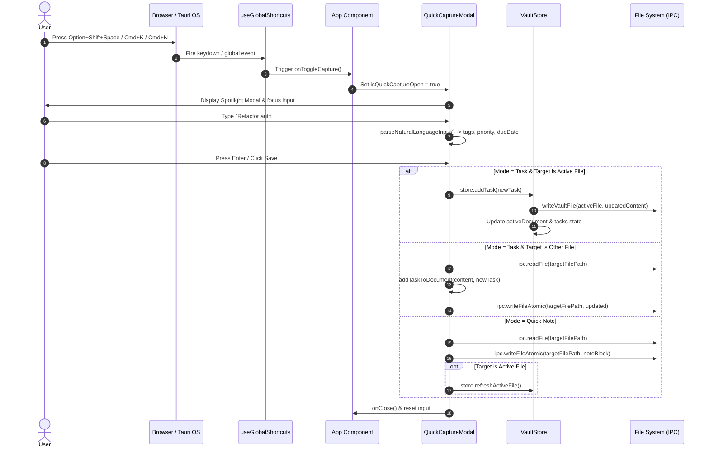

# Quick Capture & Global Shortcuts

Quick Capture provides a low-friction entry point for capturing tasks and notes without breaking focus or leaving the active workflow context. The system combines operating system-level global hotkeys via Tauri, in-app keyboard listeners, natural language token parsing, and instant markdown storage updates.

---

## Architecture & Shortcut Registration

The shortcut system operates across two boundaries: desktop OS-level hotkeys managed through Tauri plugins, and window-level browser event listeners for in-app navigation.

### Global OS Hotkey Listener (`useGlobalShortcuts`)

The custom React hook `useGlobalShortcuts` manages cross-platform shortcut registration. When running inside a Tauri desktop wrapper, it registers a system-wide hotkey using `@tauri-apps/plugin-global-shortcut`.

- **Default Global Hotkey**: `Option+Shift+Space` (macOS) or `Alt+Shift+Space` (Windows/Linux).
- **Tauri Registration**: Dynamically imports `@tauri-apps/plugin-global-shortcut`, checks registration status using `isRegistered()`, and attaches an event handler that fires `onToggleCapture` when `event.state === 'Pressed'`.
- **In-App Fallback**: Registers a DOM `keydown` listener on `window` to handle `Cmd+K` / `Ctrl+K` and `Option+Shift+Space` within the application window.
- **Cleanup Lifecycle**: On hook unmount, unregisters the Tauri global shortcut and removes the window event listener.

```typescript
// src/hooks/useGlobalShortcuts.ts
export function useGlobalShortcuts({
  onToggleCapture,
  shortcut = 'Option+Shift+Space',
}: UseGlobalShortcutsOptions = {}) { ... }
```

### In-App Keyboard Shortcuts (`App.tsx`)

The main application component (`App.tsx`) binds complementary application-wide key combinations:

| Key Combination | Scope | Target Action |
| :--- | :--- | :--- |
| `Option+Shift+Space` | OS Global / In-App | Toggle Quick Capture Modal |
| `Cmd+K` / `Ctrl+K` | In-App | Toggle Quick Capture Modal |
| `Cmd+N` / `Ctrl+N` | In-App | Open Quick Capture Modal (`setIsQuickCaptureOpen(true)`) |
| `Cmd+,` / `Ctrl+,` | In-App | Open Settings Modal (`setIsSettingsOpen(true)`) |
| `Escape` | Modal Local | Close Quick Capture Modal |
| `Enter` | Modal Local | Submit Task or Quick Note |

---

## Quick Capture Modal Workflow

`QuickCaptureModal` presents a floating spotlight interface centered in the viewport with a frosted backdrop (`backdrop-blur-sm`).

```
+-----------------------------------------------------------------------+
|  [ Task ] [ Quick Note ]               Destination: [ Inbox.md  v ]   |
|-----------------------------------------------------------------------|
|  What's on your mind?                                                 |
|  Refactor auth service #dev @medium due:2026-09-15                    |
|-----------------------------------------------------------------------|
|  [ #dev ] [ @medium ] [ 📅 2026-09-15 ]                                |
|-----------------------------------------------------------------------|
|  Esc Cancel                            Enter Save Capture [ Save ]    |
+-----------------------------------------------------------------------+
```

### 1. Modal Initialization & Focus Management
When `isOpen` transitions to `true`:
1. Modal state resets input fields and defaults capture mode to `'task'`.
2. Input element is automatically focused (`inputRef.current?.focus()`).
3. Destination target resolution determines where captured items are saved.

### 2. Destination Target Resolution
The target file dropdown resolves standard destinations in order of precedence:
1. **Active File**: The file currently open in the main view (`store.activeFile`).
2. **Inbox File**: Any file in the vault matching `inbox.md` or containing `inbox` in its relative path.
3. **First Markdown File**: The first `.md` file traversed from the root vault tree.

### 3. Natural Language Processing (`parseNaturalLanguageInput`)
As the user types, `parseNaturalLanguageInput` extracts metadata tokens in real-time, displaying parsed values as interactive preview chips below the input box:

- **Priority Tokens**: `@high`, `@medium`, `@low` map to task priorities.
- **Category Tags**: `#tag-name` tokens are accumulated into a `tags` string array.
- **Due Date Expressions**:
  - `due:YYYY-MM-DD` extracts explicit dates.
  - `tomorrow` sets due date to `current_date + 1 day`.
  - `today` sets due date to current ISO date string (`YYYY-MM-DD`).
- **Clean Title**: Strips inline NLP markers, preserving clean title text for markdown task generation.

---

## Instant Ingestion & Storage Mechanism

When the user submits an entry (`Enter` or "Save Capture" click), `handleSave()` handles storage according to capture type (`task` vs `note`) and destination context.


*Figure 1: End-to-end execution sequence from hotkey trigger to natural language processing and atomic storage write.*

### Task Ingestion Logic
- **Target == Active File**: Calls `useVaultStore.getState().addTask(newTask)`. The store performs an optimistic UI update with a temporary ID (`task-temp-*`), updates markdown content via `addTaskToDocument()`, writes to disk via atomic IPC, and re-parses document structure.
- **Target != Active File**: Reads document content directly via `ipc.readFile(targetFilePath)`, appends task standard syntax (`- [ ] Title #tags @priority due:YYYY-MM-DD`) via `addTaskToDocument()`, and persists via `ipc.writeFileAtomic()`.

### Quick Note Ingestion Logic
Quick note capture formats a timestamped section header and appends raw note text directly to the selected destination document:

```markdown


### Note (8/27/2026, 2:30:00 PM)
Meeting notes with team regarding system architecture #notes
```

If the note destination matches the active file, `QuickCaptureModal` executes `store.refreshActiveFile()` to sync the main editor state without requiring manual reloads.

---

## Test Coverage & Invariants

Quick Capture behavior and global shortcut handling are validated through dedicated unit test suites in `src/components/capture/QuickCaptureModal.test.tsx`:

- **Visibility & Mount**: Verifies zero DOM rendering when `isOpen` is `false`, and correct Spotlight UI layout when `isOpen` is `true`.
- **Autofocus**: Verifies focus automatically locks to the input field on mount.
- **Mode Switching**: Verifies toggling between "Task" and "Quick Note" modes.
- **Destination Resolution**: Tests dropdown population and selection state against vault hierarchy mocks.
- **NLP Token Parsing**: Asserts `#tags`, `@priority`, and `due:date` tokens render preview badges and parse accurately into structured payloads.
- **Keyboard Submission & Dismissal**: Tests Enter key submission, Escape key modal dismissal, and backdrop click handlers.
