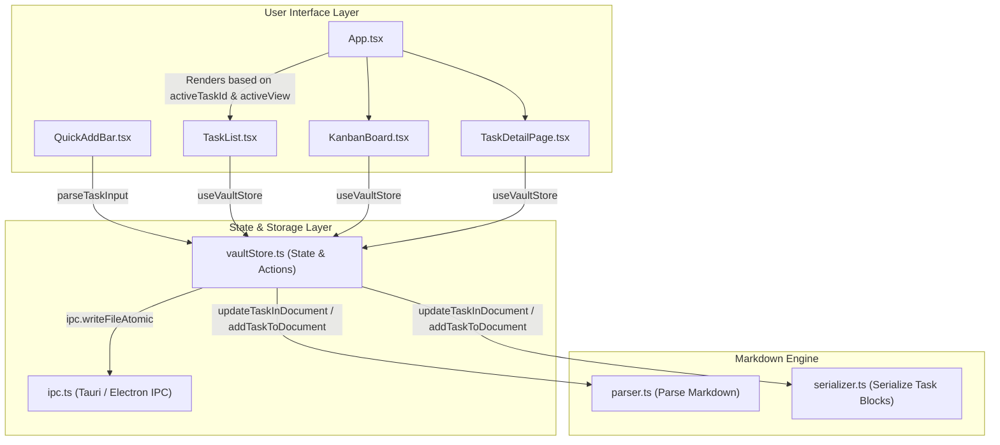
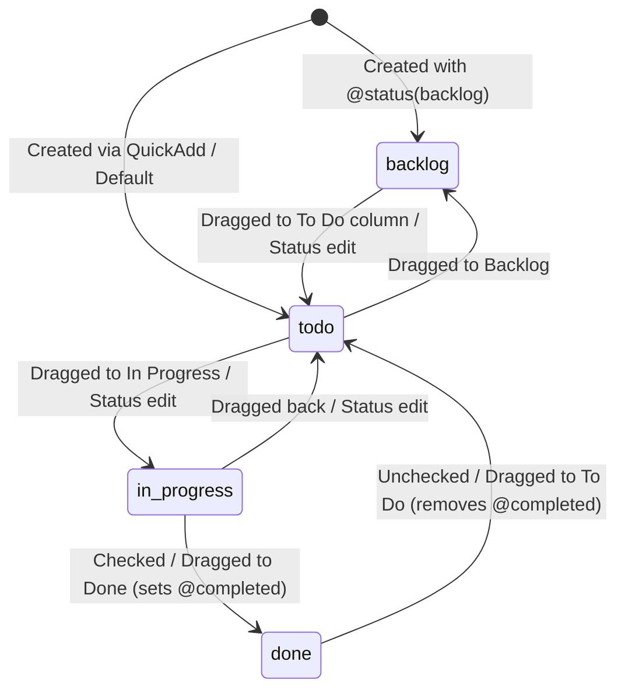

# Task Lifecycle & View Workflows

This document provides a technical walkthrough of task management workflows in QuietFlow. It details how tasks move through creation, state editing, drag-and-drop Kanban stage updates, WIP limit checks, subtask breakdown management, deletion, and cross-file relocation, while maintaining state consistency and atomic persistence across Markdown vault files.

---

## Overview & Architectural Roles

Task management in QuietFlow connects user interface components with low-level Markdown document serialization and IPC disk persistence. The system relies on a central store, dedicated Markdown parsers/serializers, and specialized view components:

- **Vault Store (`src/store/vaultStore.ts`)**: Acts as the single source of truth for task state (`tasks`), active task focus (`activeTaskId`), view selection (`activeView`), active file (`activeFile`), and folder context (`activeFolder`). It executes optimistic UI updates and orchestrates disk persistence via IPC.
- **Markdown Engine (`src/core/markdown/parser.ts`, `src/core/markdown/serializer.ts`)**: Translates plain text Markdown files into structured `TaskItem` data objects and vice versa. It recognizes inline metadata annotations, subtask line hierarchies, notes blocks, and comment threads.
- **View Hierarchy**:
  - **`TaskList` (`src/components/tasks/TaskList.tsx`)**: Displays tasks in a vertical list, supporting search filtering, priority/tag filter chips, focus buckets (*All*, *Now*, *Not Now*), and Zen Theater focus mode.
  - **`KanbanBoard` (`src/components/kanban/KanbanBoard.tsx`)**: Arranges tasks in four stage columns (`backlog`, `todo`, `in-progress`, `done`). Enables drag-and-drop stage updates and evaluates WIP limits.
  - **`TaskDetailPage` (`src/components/editor/TaskDetailPage.tsx`)**: Renders a full-page two-column workspace for comprehensive editing, subtask management, tag adjustments, and activity/comment tracking.
  - **`QuickAddBar` (`src/components/tasks/QuickAddBar.tsx`)**: Captures inline task entries with syntax parsing for quick capture across views.
  - **`App` (`src/App.tsx`)**: Serves as top-level router, mounting `TaskDetailPage` full-screen when `activeTaskId` is set, or displaying `KanbanBoard` or `TaskList` according to `activeView`.


*Figure 1: Architectural relationship between UI views, Vault Store, Markdown Engine, and IPC disk writer.*

---

## Task Metadata & Parsing Syntax

Tasks in QuietFlow are stored as GFM task list items (`- [ ]`, `- [/]`, `- [x]`) enriched with inline annotations. `parseMarkdownDocument()` processes raw file contents into `TaskItem` data structures.

### Task Status & Priority Representation

| Field | Markdown Syntax | Data Type | Recognized Values |
| :--- | :--- | :--- | :--- |
| **Checkmark Status** | `- [ ]`, `- [/]`, `- [x]` | `TaskStatus` | `todo`, `in-progress`, `done` |
| **Status Tag** | `@status(backlog)` | `TaskStatus` | `backlog`, `todo`, `in-progress`, `done` |
| **Priority** | `@high`, `@medium`, `@low` / `@priority(...)` | `TaskPriority` | `high`, `medium`, `low` |
| **Due Date** | `@due(YYYY-MM-DD)` / `due:YYYY-MM-DD` | `string` | ISO 8601 date string |
| **Completion Date** | `@completed(YYYY-MM-DD)` | `string` | ISO 8601 date string |
| **Tags** | `#tagname` | `string[]` | Alphanumeric tag identifiers |

### Indented Child Blocks

Tasks can contain indented child lines immediately following the primary task line:

- **Subtasks**: Indented checkbox items (e.g., `  - [ ] Subtask title`).
- **Notes**: Lines prefixed with `  - Notes:` or generic indented text.
- **Comments**: Lines formatted as `  - Comment (Author, YYYY-MM-DD HH:mm): Comment content`.

```markdown
- [ ] Implement AI Model Training pipeline @high @due(2026-08-30) #infra
  - Notes: Infrastructure rollout for Q3.
  - [x] Provision H100 GPU cluster
  - [ ] Run synthetic benchmark suite
  - Comment (Eduardo, 2026-08-29 07:15): Cluster provisioned in us-east-4 with 8x H100.
```

---

## State Machine & Stage Transitions

Tasks move through a four-stage state machine: `backlog` $\rightarrow$ `todo` $\rightarrow$ `in-progress` $\rightarrow$ `done`.


*Figure 2: Task status lifecycle and transition triggers.*

When a task transitions to `done`, the store automatically assigns `completedDate` to today's date (`YYYY-MM-DD`). Conversely, transitioning away from `done` removes the `completedDate` attribute.

---

## End-to-End Task Workflows

### 1. Task Creation & Quick Capture Flow

Task creation starts either in `QuickAddBar` or via the global `Cmd/Ctrl+N` Quick Capture modal:

1. **Input Parsing (`parseTaskInput`)**: `QuickAddBar` parses the input string using regular expressions to extract priority annotations (`@high`, `@medium`, `@low`), tags (`#tag`), and dates (`due:YYYY-MM-DD`, `today`, `tomorrow`).
2. **Optimistic Store Add (`addTask`)**: `vaultStore.ts` generates a temporary identifier (`task-temp-${Date.now()}-${rand}`) and optimistically appends the task to state `tasks`.
3. **Document Injection (`addTaskToDocument`)**: The store reads the target Markdown file (`ipc.readFile`), locates a target section header (such as `# Tasks` or `# Deliverables & Tasks`), and inserts serialized lines generated by `serializeTaskBlock`. If no target header exists, it appends to the document's end.
4. **Atomic Disk Write**: The updated file content is written via `ipc.writeFileAtomic`. The store then re-parses the file content to establish stable task IDs.

```typescript
// Example from src/components/tasks/QuickAddBar.tsx
const parsedTask = parseTaskInput("Implement auth service @high #devops tomorrow");
// Result: { title: "Implement auth service", priority: "high", tags: ["devops"], dueDate: "2026-08-30", status: "todo" }
await addTask(parsedTask, defaultSection);
```

### 2. Task Editing & Property Synchronization Flow

Modifications made in `TaskDetailPage` or `TaskRow` update both the reactive store state and disk file:

1. **User Action**: Updating title (on blur), notes, priority, due date, status, or tags calls `updateTask(taskId, updates)`.
2. **Optimistic Update**: `vaultStore.ts` immediately merges updates into `state.tasks` and sets `isSaving: true`.
3. **Document Mutation (`updateTaskInDocument`)**: The store identifies the target task's starting line index, computes the line range of any indented child block (subtasks, notes, comments), and replaces the range with freshly serialized content from `serializeTaskBlock`.
4. **Persistence & Refresh**: `writeVaultFile` saves the file. If the updated task belongs to the active file, `parseMarkdownDocument` updates `activeDocument`. If write fails, the optimistic update is rolled back.

### 3. Drag-and-Drop Kanban & Soft WIP Limits Flow

The `KanbanBoard` component renders four stage columns using HTML5 drag-and-drop APIs:

1. **Drag Start (`KanbanCard.tsx`)**: On `onDragStart`, `KanbanCard` populates `e.dataTransfer` with `text/plain` set to `task.id` and a JSON payload containing `taskId` and `sourceFilePath`.
2. **Drop Event (`KanbanColumn.tsx`)**: Dropping a card onto a `KanbanColumn` triggers `onTaskDrop(taskId, targetStatus)`.
3. **Store Execution**: `handleTaskDrop` calls `updateTask(taskId, { status: targetStatus, completedDate })`.
4. **WIP Limit Check**: The `in-progress` column is initialized with `maxWip={3}` in `KanbanBoard.tsx`. If `tasks.length > maxWip`, `KanbanColumn` evaluates `isExceededWip = true`. Instead of blocking drops, it displays a soft warning pill (`data-testid="wip-warning-pill"`) with `rose-500/15` styling and highlights the column border.

```tsx
// Excerpt from src/components/kanban/KanbanBoard.tsx
<KanbanColumn
  id={column.id}
  title={column.title}
  tasks={columnTasks}
  activeTaskId={activeTaskId}
  onSelectTask={(id) => setActiveTaskId(id)}
  onTaskDrop={handleTaskDrop}
  maxWip={column.id === 'in-progress' ? 3 : undefined}
/>
```

### 4. Subtask Breakdown & Progress Tracking Flow

Subtasks provide sub-item breakdown inside `TaskDetailPage`:

1. **Subtask Structure**: Each subtask is represented as a `SubtaskItem` (`{ id, title, status }`).
2. **Addition**: `handleAddSubtask` creates a subtask item and appends it to `activeTask.subtasks`. `updateTask` persists it as an indented `- [ ]` line.
3. **Toggle & Delete**: `handleToggleSubtask` flips subtask status between `todo` and `done`. `handleDeleteSubtask` removes the item from the list.
4. **Progress Calculation**: `TaskDetailPage` calculates progress percentage:
   $$\text{Progress \%} = \text{Math.round}\left(\frac{\text{completedSubtasks}}{\text{totalSubtasks}} \times 100\right)$$
   A visual progress bar renders the completion ratio (e.g., `1/3 Completed`).

### 5. Task Deletion & Cross-File Relocation Flow

- **Deletion (`deleteTask`)**: Removes the task from `state.tasks`. `deleteTaskFromDocument()` calculates the full line span of the task block—including all indented subtasks, notes, and comments—and splices those lines out of the Markdown file.
- **Relocation (`moveTask`)**: Moves a task from `sourcePath` to `destPath`:
  1. Calls `deleteTaskFromDocument()` on the source document content.
  2. Constructs a `NewTaskInput` from the target task and calls `addTaskToDocument()` on the destination document content.
  3. Writes both source and destination files atomically via `writeVaultFile`.

---

## Runtime Sequence Diagram

The sequence diagram below traces an end-to-end task update from user interaction in `TaskDetailPage` through optimistic state mutation, Markdown block serialization, atomic disk persistence, and watcher handling.

<!-- openwiki: mermaid parse failed and this diagram was converted to a text fence so it does not break rendering. Fix the diagram source and restore the mermaid fence. Parser error: Heuristic: an unescaped angle bracket inside a label breaks rendering; rephrase the label. -->
```text
sequenceDiagram
    autonumber
    participant U as User / TaskDetailPage
    participant VS as VaultStore
    participant ME as Markdown Engine (parser/serializer)
    participant FS as Disk Storage (ipc.writeFileAtomic)
    participant FW as File Watcher

    U->>VS: updateTask(taskId, updates)
    activate VS
    VS->>VS: Optimistically update state.tasks & set isSaving = true
    VS-->>U: Re-render UI with updated task state
    VS->>FS: ipc.readFile(targetFile)
    FS-->>VS: Raw Markdown content
    VS->>ME: updateTaskInDocument(content, taskId, updates)
    activate ME
    ME->>ME: Locate lineIndex & indented child block
    ME->>ME: serializeTaskBlock(mergedTask)
    ME-->>VS: Updated Markdown string
    deactivate ME
    VS->>FS: writeVaultFile(targetFile, updatedContent)
    activate FS
    FS->>FS: Record lastSelfWriteTimestamp
    FS-->>VS: File written successfully
    deactivate FS
    VS->>VS: Update activeDocument & set isSaving = false
    deactivate VS
    FW->>VS: listenVaultChanged notification
    VS->>VS: Check (now - lastSelfWriteTimestamp < 600ms)
    Note over VS: Self-write suppressed: skips active file reload
```
*Figure 3: Runtime sequence showing optimistic state updates, Markdown serialization, atomic IPC disk writes, and self-write watcher suppression.*

---

## Invariants, Edge Cases & Failure Semantics

1. **Self-Write Watcher Suppression (600ms Window)**: To prevent self-induced reload loops, `writeVaultFile()` sets `lastSelfWriteTimestamp = Date.now()`. When the vault watcher fires `listenVaultChanged`, `loadVault` checks if `Date.now() - lastSelfWriteTimestamp < 600`. If true, it skips reloading the active file, avoiding UI jumpiness or cursor displacement.
2. **Optimistic UI Rollback**: If `writeVaultFile` or `ipc.readFile` throws an error during `toggleTask`, `updateTask`, `addTask`, or `deleteTask`, the store catches the exception, restores the previous `tasks` state array, sets `isSaving: false`, and populates `state.error` with a descriptive message.
3. **Legacy Task Identifier Fallback**: Task IDs use slugified titles (e.g., `task-implement-ai-model`). If a legacy or line-index based ID (e.g., `task-12-implement-ai`) is passed to `updateTaskInDocument` or `deleteTaskFromDocument`, the parser falls back to matching by line index or title slug substring.
4. **Preservation of Non-Task Content**: `addTaskToDocument`, `updateTaskInDocument`, and `deleteTaskFromDocument` manipulate only target task blocks and section headers, leaving YAML frontmatter, standard Markdown paragraphs, and code blocks untouched.

---

## Operational Verification & Key Tests

The task lifecycle workflows are verified through unit, component, and E2E test suites:

- **`src/store/vaultStore.test.ts`**: Verifies optimistic state updates, state rollbacks on disk errors, and `moveTask` cross-file operations.
- **`src/core/markdown/parser.test.ts`**: Tests accurate extraction of inline metadata tags (`@due`, `@priority`, `#tags`), indented subtasks, notes, and comments, as well as round-trip serialization.
- **`src/components/kanban/KanbanWipLimit.test.tsx`**: Confirms that exceeding the WIP limit (`maxWip={3}`) displays the `wip-warning-pill` without blocking task drag-and-drop operations.
- **`src/components/editor/TaskDetailPage.test.tsx`**: Validates two-column layout rendering, subtask creation/toggling, tag addition/removal, comment posting, and `Escape` key navigation back to Kanban or List view.
- **`tests/e2e/task-detail-fullpage-flow.test.tsx`**: Executes a complete Playwright/React Testing Library journey: navigating from Kanban card click into full-page Task Detail view, editing subtasks and comments, verifying atomic disk writes via `ipc.writeFileAtomic`, and navigating back to the Kanban board.
