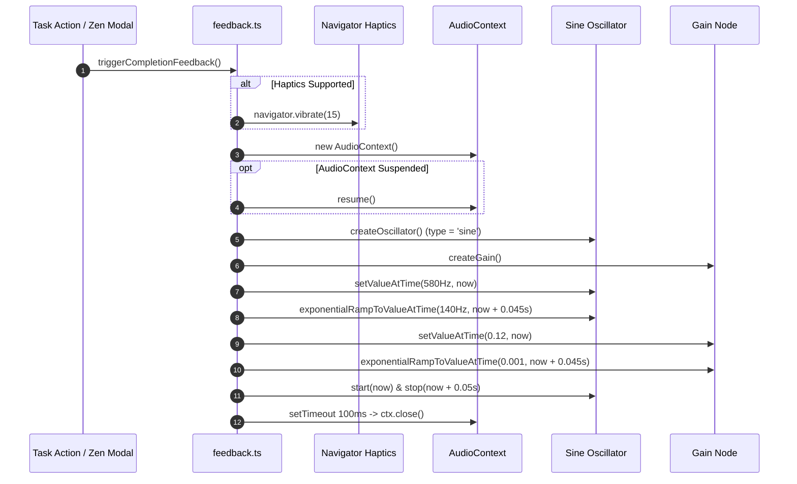

# Zen Theater Focus Mode & Dopamine Systems

QuietFlow includes **Zen Theater Focus Mode**, an executive-function support workspace designed specifically for users with ADHD and neurodivergent focus needs. Standard task management software often bombards users with complex multi-column lists, dense priority badges, tag clusters, and sidebar navigation trees. For individuals experiencing cognitive overload, executive dysfunction, or task paralysis, this visual noise causes friction and distraction.

Zen Theater addresses this by enforcing a strict **"One-Thing" focus paradigm**. When activated, QuietFlow replaces the multi-panel application interface with a distraction-free full-screen overlay centered around a single high-priority target task. This environment combines a visual time-sweep radial aura, tactile haptic vibration, zero-asset Web Audio mechanical feedback, and dynamic HTML5 canvas particle celebrations.

---

## Executive Function Support Architecture

The Zen Theater focus system is built around three distinct subsystems: isolated task modal rendering, real-time visual aura animation, and multi-sensory dopamine micro-rewards.

```
┌────────────────────────────────────────────────────────────────────────────────────────┐
│                                   TaskList Component                                  │
│                          (Task selection & Zen trigger handler)                        │
└───────────────────────────────────────────┬────────────────────────────────────────────┘
                                            │
                                  opens modal with task
                                            ▼
┌────────────────────────────────────────────────────────────────────────────────────────┐
│                                 ZenTheaterModal Modal                                  │
│                                                                                        │
│   ┌──────────────────────────────────┐            ┌────────────────────────────────┐   │
│   │     1-Second Timer Ticker        │            │    SVG Visual Sweeping Aura    │   │
│   │  (tracks secondsElapsed state)   │            │   (progressRatio calculation)  │   │
│   └──────────────────────────────────┘            └────────────────────────────────┘   │
│                                                                                        │
│                                on Complete Task trigger                                │
│                                           │                                            │
│                 ┌─────────────────────────┴─────────────────────────┐                  │
│                 ▼                                                   ▼                  │
│   ┌───────────────────────────┐                       ┌───────────────────────────┐    │
│   │ triggerCompletionFeedback │                       │    triggerCelebration     │    │
│   │   (Web Audio & Haptics)   │                       │ (HTML5 Canvas Particles)  │    │
│   └───────────────────────────┘                       └───────────────────────────┘    │
└────────────────────────────────────────────────────────────────────────────────────────┘
```

*Component architecture of the Zen Theater focus workspace and feedback pipeline.*

---

## Zen Theater Modal & Visual Sweep Aura

The modal interface (`src/components/zen/ZenTheaterModal.tsx`) renders a full-screen backdrop (`#FAF9F6`) with fixed positioning (`fixed inset-0 z-50`), completely hiding the underlying vault document tree, task counts, and navigation controls.

### Visual Sweep Aura Mechanics

At the center of the theater is a 480px radial aura container featuring an ambient emerald glow (`bg-emerald-400/20 blur-3xl`) and an SVG circular progress track (`r = 175px`). The timer arc calculates its stroke offset dynamically based on elapsed seconds:

- **Timer State**: Managed via a React `useState(0)` hook tracking `secondsElapsed`. When `isOpen` becomes `true`, a `setInterval` updates `secondsElapsed` every 1,000 milliseconds.
- **Progress Ratio**: Evaluated as `progressRatio = Math.min(secondsElapsed / totalSeconds, 1)`, defaulting to a 25-minute focus session (`durationMinutes = 25`, equivalent to 1,500 total seconds).
- **SVG Arc Math**:
  $$\text{Circumference} = 2 \cdot \pi \cdot r = 2 \cdot \pi \cdot 175 \approx 1099.56\text{px}$$
  $$\text{strokeDashoffset} = \text{circumference} - (\text{progressRatio} \cdot \text{circumference})$$
- **Orientation**: The SVG element is rotated by `-90deg` (`-rotate-90`) so that the sweeping arc starts at the 12 o'clock top position and glides clockwise around the task.
- **Luminous Effect**: The foreground stroke (`#059669`) features a drop-shadow filter (`drop-shadow(0 0 12px rgba(16, 185, 129, 0.65))`), giving the timer a soft visual presence rather than a stressful countdown digit.

### Seamless Task Presentation

To prevent visually segmented "card inside modal" boxiness, task details are rendered seamlessly inside the aura circle without a white background container (`absolute inset-8 flex flex-col items-center justify-center`). The task view highlights:
1. **Focus Header**: An uppercase label (`Current Focus`) styled in `text-forest-700` with wide tracking (`tracking-widest`).
2. **Task Title**: Prominently displayed in bold 3xl text (`text-forest-900 font-extrabold max-w-[280px]`).
3. **Task Notes**: Displayed below the title as constrained secondary text (`line-clamp-2 max-w-[240px] text-stone-600`).

---

## Web Audio API Mechanical Feedback

To provide neurodivergent dopamine micro-rewards upon task completion without introducing heavy external sound files or asset loading latency, QuietFlow synthesizes tactile audio on demand via the Web Audio API (`src/utils/feedback.ts`).

### Acoustic Frequency & Gain Envelope

The function `triggerCompletionFeedback()` programmatically constructs a warm, organic "wooden-pebble" mechanical pop sound using a single sine wave oscillator and an exponential gain envelope.



*Web Audio frequency decay and memory cleanup sequence during task completion.*

- **Haptic Vibration**: Invokes `navigator.vibrate(15)` to provide a 15-millisecond physical rumble on supported touch screens and trackpads.
- **Pitch Envelope**: The oscillator frequency starts at 580 Hz at `ctx.currentTime` and exponentially drops down to 140 Hz over 45 milliseconds (`exponentialRampToValueAtTime(140, now + 0.045)`).
- **Gain Envelope**: The volume starts at a gentle amplitude of `0.12` and exponentially decays to `0.001` over 45 milliseconds.
- **Resource Cleanup**: To prevent memory leaks or audio context accumulation, a `setTimeout` callback closes the `AudioContext` instance (`ctx.close()`) after 100 milliseconds.

---

## HTML5 Canvas Celebration Particle Engine

When a task is completed, QuietFlow fires a full-screen particle celebration engine (`src/utils/celebrations.ts`). The engine spawns theme-based floating graphics (emojis, stylized typography, shape glyphs) that dynamically glide, rotate, and fade out across the viewport.

### Theme Configurations

The engine includes 12 built-in kid-friendly, cartoon, and meme-inspired dopamine themes defined in `CELEBRATION_THEMES`:

| Theme Name | Type | Elements / Glyphs | Trajectory Mode | Particle Count |
| :--- | :--- | :--- | :--- | :--- |
| **Unicorn Soar** | `emoji` | 🦄, 🌈, ✨, ⭐, 💖 | `fly-across` | 22 |
| **Banana Minion** | `emoji` | 🍌, 🟡, 🎉, 🌟, 🥳 | `burst-up` | 25 |
| **Smurf Victory** | `emoji` | 🍄, 💙, ⭐, ✨, 🧢 | `spiral-rain` | 22 |
| **Doge Wow** | `text` | 🐕, `such wow`, `very done`, `much focus` | `float-up` | 16 |
| **Nyan Cat** | `emoji` | 🐱, 🌈, ⭐, ✨, 💖 | `fly-across` | 28 |
| **Dancing Sprout** | `emoji` | 🌱, 🌸, 🍃, 🌼, ✨ | `float-up` | 24 |
| **Starlight Fireworks** | `emoji` | 🎆, 🎇, ✨, 🌟, 💫 | `burst-up` | 30 |
| **Emerald Gems** | `emoji` | 💎, ✨, 💚, 🍀, 🌟 | `burst-up` | 20 |
| **Sakura Swirl** | `emoji` | 🌸, 🌺, 🍃, ✨, 💮 | `spiral-rain` | 24 |
| **Cosmic Comet** | `emoji` | ☄️, 🌌, ⭐, ✨, 🪐 | `fly-across` | 20 |
| **Pizza Party** | `emoji` | 🍕, 🥤, 🎉, 🧀, 🔥 | `burst-up` | 18 |
| **Rocket Launch** | `emoji` | 🚀, 🔥, 💨, ⭐, 🌍 | `fly-across` | 20 |

### Trajectory Physics Engine

Each `Particle` instance is initialized with initial coordinates $(x, y)$, linear velocity $(v_x, v_y)$, angular position ($\theta$), angular velocity ($v_{\text{rot}}$), opacity ($\alpha = 1.0$), and a random alpha decay rate ($\Delta\alpha \in [0.008, 0.020]$ per frame):

<!-- openwiki: mermaid parse failed and this diagram was converted to a text fence so it does not break rendering. Fix the diagram source and restore the mermaid fence. Parser error: Heuristic: an unescaped angle bracket inside a label breaks rendering; rephrase the label. -->
```text
flowchart TD
    Init["triggerCelebration(themeIndex)"] --> Canvas["Create / Reuse #celebration-canvas-overlay"]
    Canvas --> Spawn["Spawn N Particles into particles array"]
    Spawn --> Loop["requestAnimationFrame(animate)"]
    Loop --> Clear["ctx.clearRect(0, 0, width, height)"]
    Clear --> Update["p.x += p.vx<br/>p.y += p.vy<br/>p.alpha -= p.decay"]
    Update --> Check{"p.alpha > 0?"}
    Check -- Yes --> Draw["p.draw(ctx) with rotation & font shadow"]
    Check -- No --> Filter["Filter out dead particle"]
    Draw --> Loop
    Filter --> Remaining{"particles.length > 0?"}
    Remaining -- Yes --> Loop
    Remaining -- No --> Cleanup["cancelAnimationFrame & Remove Canvas DOM Node"]
```

*Particle rendering update loop and DOM overlay lifecycle.*

1. **`fly-across`**: Particles spawn off-screen left ($x = -20$) and sweep horizontally right with high velocity ($v_x \in [6, 13]$) and minor vertical drift.
2. **`burst-up`**: Particles launch upwards from the lower center of the screen at steep angled velocities, simulating a fireworks pop.
3. **`spiral-rain`**: Particles drop from top off-screen ($y = -20$) with sinusoidal horizontal sway ($v_x = \sin(\text{rand}) \cdot 2$).
4. **`float-up`**: Particles emerge from below the viewport ($y = \text{height} + 10$) and gently rise upwards against gravity.

### Canvas Overlay Lifecycle & Auto-Teardown

- **Overlay Creation**: `triggerCelebration()` dynamically creates a single `<canvas id="celebration-canvas-overlay">` styled with `position: fixed; inset: 0; pointer-events: none; z-index: 999999;`.
- **Render Loop**: Animates via `requestAnimationFrame`. On each frame, `particles = particles.filter(p => p.update())` updates physics and draws living particles to `activeCtx`.
- **Automatic Teardown**: As soon as `particles.length` reaches `0`, the loop cancels `animationFrameId`, removes `activeCanvas` from `document.body`, and resets module references (`activeCanvas = null`, `activeCtx = null`).

---

## Workspace Integration & Keyboard Control

Zen Theater integrates into the primary task list workspace (`src/components/tasks/TaskList.tsx`).

### Candidate Task Resolution

Users can open Zen Theater from two primary entrypoints:
- **Global Header Button**: The `FocusHeader` includes a "Zen Focus" control. Calling `handleOpenZen()` selects a candidate task:
  ```typescript
  const candidate = specificTask || filteredTasks.find((t) => t.status !== 'done') || tasks[0] || null;
  ```
- **Task Row Quick Focus**: Hovering over any `TaskRow` reveals a dedicated "Focus in Zen Theater" button, which opens Zen Theater bound directly to that specific task item.

### Completion & Keyboard Shortcuts

- **Task Completion Action**: Clicking "✓ Complete Task" inside `ZenTheaterModal` calls `handleComplete()`, executing the following sequence:
  1. `triggerCompletionFeedback()` (plays mechanical click pop and haptic rumble).
  2. `triggerCelebration()` (spawns full-screen celebration confetti).
  3. `onCompleteTask(task.id)` (triggers `useVaultStore.getState().toggleTask(task.id)`).
  4. `onClose()` (closes modal view).
- **Escape Key Teardown**: The modal registers a window `keydown` listener for `e.key === 'Escape'`, triggering `onClose()` to allow quick exit without completing the task.

---

## Verification & Unit Test Coverage

The Zen Theater focus system and dopamine utilities are thoroughly verified in the automated test suite:

- **`ZenTheaterModal.test.tsx`**: Tests dialog rendering (`role="dialog"`), header labels (`Current Focus`), task title displays, task completion click handlers (`onCompleteTask`), and modal close callbacks (`onClose`).
- **`celebrations.test.ts`**: Verifies that `CELEBRATION_THEMES` contains at least 10 unique kid-friendly and meme themes (such as `Unicorn Soar`, `Banana Minion`, `Smurf Victory`, `Doge Wow`, `Nyan Cat`) and verifies non-throwing behavior of `triggerCelebration()` in JSDOM environments.
- **`feedback.test.ts`**: Asserts that `triggerCompletionFeedback()` executes safely without throwing errors in headless Node.js / JSDOM test runners.
